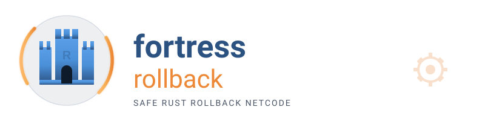

<p align="center">
  
</p>

<p align="center">
  <a href="https://crates.io/crates/fortress-rollback"></a>
  <a href="https://wallstop.github.io/fortress-rollback/"></a>
  <a href="https://github.com/wallstop/fortress-rollback/actions/workflows/ci-rust.yml"></a>
</p>

# Fortress Rollback

Fortress Rollback is a correctness-first peer-to-peer rollback networking library for
deterministic multiplayer games. It uses 100% safe Rust (`#![forbid(unsafe_code)]`), returns
recoverable errors instead of panicking in production code, and exposes a request-driven game
loop: advance the session, then fulfill the ordered save, load, and simulation requests it returns.

The project began as a hardened fork of [GGRS](https://github.com/gschup/ggrs) and now includes
graceful peer drop, runtime input delay, redundant-host spectators, and opt-in hot-join.

> [!WARNING]
> Fortress Rollback is alpha software. Expect API changes before 1.0 and test upgrades against
> your game before release. The project follows semantic versioning to the extent possible.

## Install and Try It

Add the library and Serde derives to your game:

```toml
[dependencies]
fortress-rollback = "0.12"
serde = { version = "1", features = ["derive"] }
```

To see a complete deterministic loop first, clone this repository and run:

```bash
cargo run --example sync_test
```

Then follow [Build Your First Session](docs/getting-started.md). It starts without networking so
you can prove that your simulation survives rollback before debugging transport or peer setup.

## The Integration Loop

Every game follows the same four steps:

1. Define compact, fixed-width input and deterministic game-state types.
2. Build a `SyncTestSession` during development or a `P2PSession` for connected peers.
3. Poll the session, submit every local player's input, and call `advance_frame`.
4. Fulfill every returned `FortressRequest` in order: save, load, or advance game state.

The [first-session guide](docs/getting-started.md) shows this loop as a runnable program. The
[request-handling example](examples/request_handling.rs) shows the manual and macro forms.

## Choose the Right Guide

| Goal | Canonical page |
|------|----------------|
| Build a first deterministic session | [Getting Started](docs/getting-started.md) |
| Integrate sessions, requests, and events | [User Guide](docs/user-guide.md) |
| Run maintained examples | [Examples](examples/README.md) |
| Tune latency, prediction, and input delay | [Network Tuning](docs/tuning.md) |
| Add browser, engine, or custom transport support | [Platforms and custom sockets](docs/user-guide.md#web--wasm-integration) |
| Prepare a game for release | [Production Checklist](docs/production-checklist.md) |
| Understand the public API | [docs.rs](https://docs.rs/fortress-rollback/latest/fortress_rollback/) |
| Migrate from GGRS | [Migration Guide](docs/migration.md) |

For protocol internals and guarantees, see the [architecture](docs/architecture.md),
[determinism model](docs/specs/determinism-model.md), and
[threat model](docs/threat-model.md).

## Network Requirements

The deterministic simulation fleet validates full-mesh correctness and liveness through `N=16`
under documented profiles. This result is not a production endorsement: full meshes above eight
players exceed attested industry practice. Measure your game-state cost, input width, topology,
bandwidth, stalls, and target hardware before choosing a supported tier. Start with the measured
profiles in [Network Tuning](docs/tuning.md).

## Project Notes

Questions and bug reports belong in [GitHub Issues](https://github.com/wallstop/fortress-rollback/issues).
The project uses substantial AI assistance for code, documentation, tests, and formal
specifications, with human review for architecture and final approval.

Fortress Rollback is dual-licensed under [MIT](LICENSE-MIT) or
[Apache-2.0](LICENSE-APACHE), at your option.
