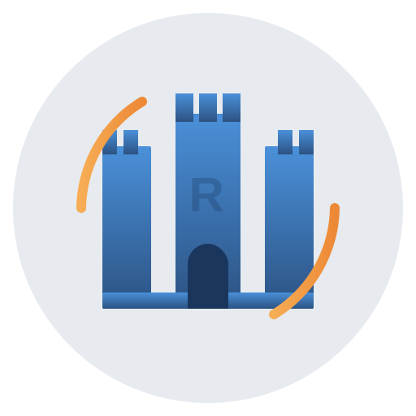

<p align="center">
  
</p>

# Fortress Rollback vs GGRS

This document summarizes the key differences between **Fortress Rollback** (this library) and the original **GGRS** (good game rollback system), as well as the bugs discovered and fixed during the fork's development.

## Quick Summary

| Category | GGRS | Fortress Rollback |
|----------|------|-------------------|
| **Determinism** | `HashMap`/`HashSet` (non-deterministic iteration) | `BTreeMap`/`BTreeSet` (guaranteed order) |
| **Panic Safety** | Some `assert!` and `panic!` in library code | All converted to recoverable errors |
| **Test Coverage** | Basic test suite | 620+ tests (~92% coverage) |
| **Formal Verification** | None | TLA+, Z3 SMT proofs, Kani proofs |
| **Hashing** | `DefaultHasher` (random seed per process) | FNV-1a deterministic hashing |
| **Dependencies** | `bitfield-rle`, `varinteger`, `rand` | Internal implementations (fewer deps) |
| **Type Safety** | `Config::Address` requires `Hash` | `Config::Address` requires `Hash` + `Ord` |

---

## Breaking Changes from GGRS

### 1. Crate and Type Renames

```rust
// Before (GGRS)
use ggrs::{GgrsError, GgrsEvent, GgrsRequest};

// After (Fortress Rollback)
use fortress_rollback::{FortressError, FortressEvent, FortressRequest};
```

### 2. `Config::Address` Now Requires `Ord`

```rust
// Before: Only needed Clone + PartialEq + Eq + Hash + Debug
// After: Also needs PartialOrd + Ord

#[derive(Clone, PartialEq, Eq, PartialOrd, Ord, Hash, Debug)]
struct MyAddress { /* ... */ }
```

**Why:** Enables deterministic iteration using `BTreeMap` instead of `HashMap`.

### 3. New Configuration APIs

Fortress Rollback introduces structured configuration with presets:

```rust
use fortress_rollback::{SyncConfig, ProtocolConfig, TimeSyncConfig};

let session = SessionBuilder::<MyConfig>::new()
    .with_sync_config(SyncConfig::high_latency())
    .with_protocol_config(ProtocolConfig::competitive())
    .with_time_sync_config(TimeSyncConfig::responsive())
    .start_p2p_session()?;
```

---

## Bugs Fixed (By Priority)

### 🔴 Critical - Would cause crashes or game-breaking issues

#### 1. Frame 0 Rollback Crash

**Likelihood:** High (occurs under poor network conditions early in game)

**Issue:** When a misprediction was detected at frame 0 (the first frame) and a remote input correction arrived before advancing past it, the session would crash with:

```
InvalidFrame { frame: Frame(0), reason: "must load frame in the past" }
```

**Root Cause:** `adjust_gamestate()` attempted `load_frame(0)` which fails because you cannot load the frame you're currently on.

**Fix:** Added guard to detect when `frame_to_load >= current_frame` and skip rollback (just reset predictions), since we haven't advanced past the incorrect frame yet.

---

#### 2. Multi-Process Checksum Desync (BUG-001)

**Likelihood:** High (occurs in any multi-process game with desync detection)

**Issue:** When running multiple game instances (e.g., testing P2P locally), checksum comparisons would fail even with identical game states.

**Root Cause:** Two issues:

1. `std::collections::hash_map::DefaultHasher` uses a random seed per process, so different processes produce different hashes for identical data
2. Checksum computation over all frames failed when older frames were discarded from input queue at different times on different peers

**Fix:**

- Created new `fortress_rollback::hash` module with FNV-1a deterministic hashing
- Window-based checksum computation using last 64 frames ensures frames are always available for both peers

---

### 🟡 High - Could cause desyncs or incorrect behavior

#### 3. Non-Deterministic Collection Iteration

**Likelihood:** Medium-High (depends on player count and frame timing)

**Issue:** GGRS used `HashMap` and `HashSet` throughout. While the values stored were correct, iteration order is not guaranteed and can vary between:

- Different runs of the same program
- Different platforms (x86 vs ARM)
- Different compiler versions

**Impact:** Any code that iterated over these collections (player inputs, checksums, network endpoints) could behave differently across peers, leading to subtle desyncs.

**Fix:** Replaced all `HashMap` with `BTreeMap` and `HashSet` with `BTreeSet`. All collection iteration now has predictable, sorted ordering.

---

#### 4. False Positive Desync Detection

**Likelihood:** Medium (occurs during rollbacks with active desync checking)

**Issue:** In `P2PSession::advance_frame()`, it was possible for a desync to incorrectly be detected when:

1. A checksum-changing rollback was enqueued
2. A to-be-rolled-back frame was marked as confirmed  
3. That frame's still-incorrect checksum was sent to peers

**Fix:** Reordered operations to ensure checksums are computed after rollback completion. (Fixed in upstream GGRS 0.11, carried forward in Fortress)

---

### 🟢 Medium - Edge cases or quality-of-life issues

#### 5. `assert!` Panics in Production Code

**Likelihood:** Low-Medium (depends on edge case triggers)

**Issue:** Several `assert!` macros in library code would panic on unexpected conditions instead of returning errors:

- `src/rng.rs` - Empty or invalid ranges in random number generation
- `src/input_queue.rs` - Queue length validation
- Various other locations

**Fix:** Converted all `assert!` to `report_violation!` macro with graceful recovery. Library code now returns `Result` types instead of panicking.

---

#### 6. Spectator Confirmed Input Panic

**Likelihood:** Low (spectator with missing data)

**Issue:** `InputQueue::confirmed_input` would panic if called when data was missing.

**Fix:** Now returns `Result<T, FortressError>` and bubbles the error up through the spectator session.

---

#### 7. Invalid Array Index in TimeSync

**Likelihood:** Low (negative frame numbers)

**Issue:** Potential out-of-bounds array access when frame numbers were negative or in edge cases.

**Fix:** Added bounds checking that skips updates rather than panicking.

---

## New Features

### Deterministic Hashing Module

```rust,ignore
use fortress_rollback::hash::{fnv1a_hash, DeterministicHasher};

// Hash any serializable data deterministically
let checksum = fnv1a_hash(&game_state);

// Or use the hasher directly
let mut hasher = DeterministicHasher::new();
hasher.write(&data);
let hash = hasher.finish();
```

### Confirmed Inputs API

```rust
// Get confirmed inputs for computing deterministic checksums
let inputs = session.confirmed_inputs_for_frame(frame)?;
```

### Violation Pipeline

Fortress Rollback replaces GGRS's `assert!` panics with a structured telemetry system. When internal invariants are violated, instead of crashing, the library:

1. **Reports the violation** with structured context (severity, category, location, frame number)
2. **Attempts graceful recovery** where possible
3. **Notifies observers** for debugging, metrics, or alerting

**Why this matters:** In GGRS, a network glitch or edge case could cause `assert!` to panic and crash your game. Fortress Rollback instead logs the issue and continues, allowing you to debug production issues without losing player sessions.

#### Violation Severities

```rust,ignore
ViolationSeverity::Warning   // Unexpected but recovered automatically
ViolationSeverity::Error     // Serious issue, may degrade behavior
ViolationSeverity::Critical  // State may be corrupted, desync possible
```

#### Violation Categories

```rust,ignore
ViolationKind::FrameSync         // Frame counter mismatch
ViolationKind::InputQueue        // Input sequence gaps or corruption
ViolationKind::StateManagement   // State save/load issues
ViolationKind::NetworkProtocol   // Protocol state machine errors
ViolationKind::ChecksumMismatch  // Desync detection triggered
ViolationKind::Configuration     // Invalid parameter combinations
ViolationKind::Synchronization   // Excessive sync retries, timeouts
ViolationKind::InternalError     // Library bugs (should never happen)
```

#### Using the Violation Observer

```rust,ignore
use fortress_rollback::telemetry::{CollectingObserver, ViolationSeverity};
use std::sync::Arc;

let observer = Arc::new(CollectingObserver::new());
let session = SessionBuilder::new()
    .with_violation_observer(observer.clone())
    .start_p2p_session()?;

// After gameplay, check for issues
if !observer.is_empty() {
    for violation in observer.violations_at_severity(ViolationSeverity::Error) {
        log::error!("Session issue: {} at {}", violation.message, violation.location);
    }
}
```

Built-in observers:

- **`TracingObserver`** (default): Logs to the `tracing` crate
- **`CollectingObserver`**: Stores violations for testing/debugging
- **`CompositeObserver`**: Forwards to multiple observers

### Configuration Presets

**Why this exists:** GGRS uses hardcoded constants for network timing, buffer sizes, and sync behavior. This works for "average" conditions but fails in edge cases. Fortress Rollback exposes these as configurable structs with presets, so you can tune behavior for LAN tournaments, mobile networks, or high-latency WAN play.

**Key configuration areas:**

| Config | Controls | Why It Matters |
|--------|----------|----------------|
| `SyncConfig` | Connection handshake timing | Faster sync on LAN, more retries on lossy networks |
| `ProtocolConfig` | Network quality reporting, timeouts | Affect disconnect detection sensitivity |
| `TimeSyncConfig` | Frame timing window size | Trade-off between smoothness and responsiveness |
| `SpectatorConfig` | Spectator buffer and catch-up | Smooth streaming vs low latency viewing |
| `InputQueueConfig` | Input buffer size | Memory vs max rollback distance |

Built-in presets for common network scenarios:

```rust,ignore
// Sync configuration presets
SyncConfig::lan()               // LAN/local network (fast sync)
SyncConfig::high_latency()      // High RTT connections (100-200ms)
SyncConfig::lossy()             // Packet loss environments (5-15%)
SyncConfig::mobile()            // Mobile/cellular networks
SyncConfig::competitive()       // Esports/tournament (fast, strict)

// Protocol configuration presets
ProtocolConfig::competitive()   // Low-latency competitive play
ProtocolConfig::high_latency()  // High RTT tolerance
ProtocolConfig::mobile()        // Mobile network tolerance
ProtocolConfig::debug()         // Development/debugging

// Time sync configuration presets
TimeSyncConfig::lan()           // LAN play (small window)
TimeSyncConfig::responsive()    // Prioritize responsiveness
TimeSyncConfig::smooth()        // Prioritize smoothness
TimeSyncConfig::mobile()        // Very large window for jitter
TimeSyncConfig::competitive()   // Fast adaptation

// Spectator configuration presets
SpectatorConfig::local()        // Local viewing (minimal latency)
SpectatorConfig::fast_paced()   // Fast-paced action games
SpectatorConfig::slow_connection() // Poor network spectators
SpectatorConfig::mobile()       // Mobile spectators
SpectatorConfig::broadcast()    // Streaming/tournament broadcasts

// Input queue configuration presets
InputQueueConfig::standard()    // Default (128 frames)
InputQueueConfig::high_latency() // High-latency tolerance (256 frames)
InputQueueConfig::minimal()     // Memory-constrained (32 frames)

// Chaos socket presets for testing
ChaosConfig::passthrough()      // No chaos (testing baseline)
ChaosConfig::poor_network()     // Typical poor conditions
ChaosConfig::terrible_network() // Extreme conditions
ChaosConfig::mobile_network()   // Mobile/cellular simulation
ChaosConfig::wifi_interference() // WiFi with interference
ChaosConfig::intercontinental() // High-latency stable connection
```

---

## Code Quality Improvements

### Formal Verification

- **4 TLA+ specifications** covering core protocols
- **56 Kani proofs** for bounded model checking
- **45 Z3 SMT proofs** for algorithmic correctness

### Testing

- **620+ tests** (419 unit + 206 integration)
- **~92% code coverage**
- Property-based tests with proptest
- Mutation testing (95% detection rate)
- Loom concurrency tests
- Multi-process network tests

### Documentation

- Comprehensive rustdoc with examples
- Architecture documentation with ASCII diagrams
- User guide with configuration reference
- Migration guide from GGRS

### Dependencies Reduced

- Replaced `bitfield-rle` + `varinteger` with internal RLE implementation
- Replaced `rand` with internal deterministic PRNG
- Cleaner dependency tree

---

## Migration Checklist

- [ ] Update `Cargo.toml`: `ggrs = "0.11"` → `fortress-rollback = "0.11"`
- [ ] Update imports: `use ggrs::*` → `use fortress_rollback::*`
- [ ] Rename types: `GgrsError` → `FortressError`, etc.
- [ ] Add `Ord` + `PartialOrd` to your `Config::Address` type
- [ ] (Optional) Update to new configuration APIs for better presets

See the full [Migration Guide](./migration.md) for detailed instructions.

---

## Summary

Fortress Rollback is a **correctness-first fork** of GGRS. The main benefits are:

1. **Determinism guaranteed** - No more subtle desyncs from collection iteration order
2. **Panic-free** - All library code returns `Result` types
3. **Battle-tested** - 620+ tests and formal verification
4. **Better debugging** - Violation observers and deterministic hashing

For most users, migration is straightforward: rename imports, add `Ord` to your address type, and enjoy more reliable netcode.

See the [Migration Guide](./migration.md) for step-by-step instructions.
