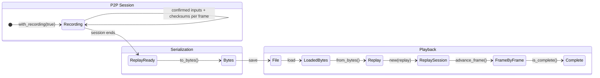
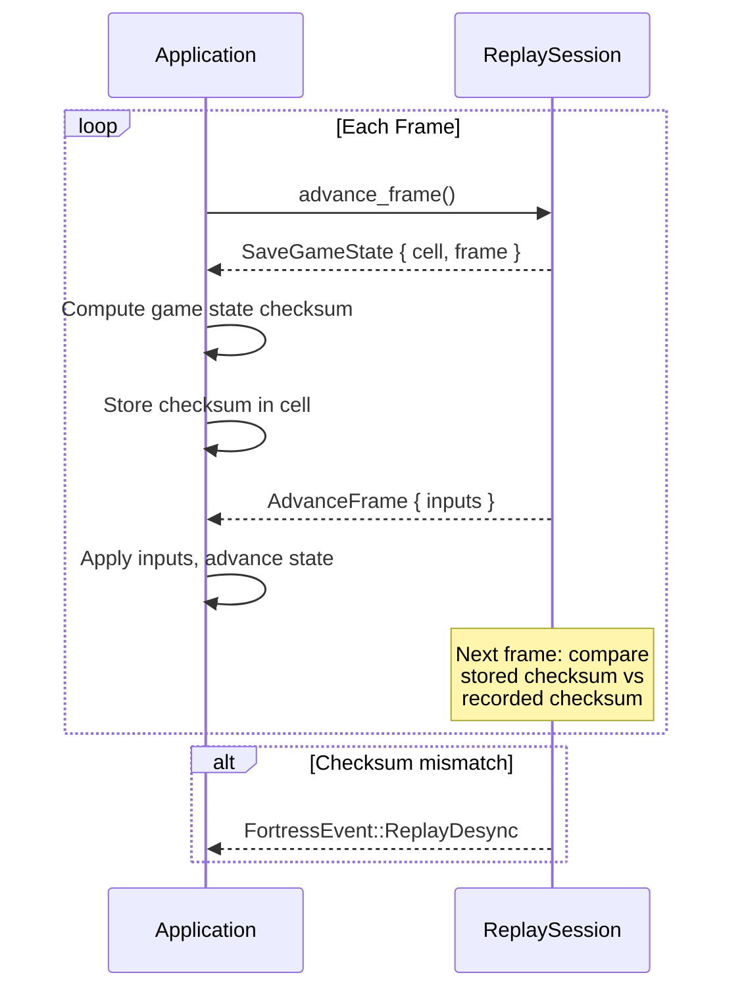

<!-- SYNC: This source doc syncs to wiki/Replay.md. -->

<p align="center">
  
</p>

# Match Replay System

Record P2P matches and play them back deterministically. Use replays for match review, determinism verification, streaming, and testing.

## Table of Contents

1. [How It Works](#how-it-works)
2. [Quick Start -- Recording](#quick-start----recording)
3. [Quick Start -- Playback](#quick-start----playback)
4. [Validation Mode](#validation-mode)
   - [How Validation Works](#how-validation-works)
   - [Validation Playback Loop](#validation-playback-loop)
5. [API Reference](#api-reference)
6. [Use Cases](#use-cases)
7. [Common Patterns](#common-patterns)
   - [into_replay vs take_replay](#into_replay-vs-take_replay)
   - [Replay Browser with Metadata](#replay-browser-with-metadata)

---

## How It Works



---

## Quick Start -- Recording

```rust
use fortress_rollback::{SessionBuilder, Config, Session, PlayerType, PlayerHandle};
use std::net::SocketAddr;

// 1. Enable recording on the session builder
let mut session = SessionBuilder::<MyConfig>::new()
    .with_num_players(2)?
    .add_player(PlayerType::Local, PlayerHandle::new(0))?
    .add_player(PlayerType::Remote("10.0.0.2:7000".parse()?), PlayerHandle::new(1))?
    .with_recording(true) // <-- enable replay recording
    .start_p2p_session(socket)?;

// 2. Run your game loop (see user-guide.md for the full loop)
// ...

// 3. Extract the replay when the session ends
let replay = session.into_replay()?;

// 4. Serialize and save to disk
let bytes = replay.to_bytes()?;
std::fs::write("match.replay", &bytes)?;
```

!!! tip "into_replay vs take_replay"
    Use `into_replay()` when the session is finished -- it consumes the session.
    Use `take_replay()` to extract the replay mid-session without consuming it (e.g., for auto-save).

---

## Quick Start -- Playback

```rust
use fortress_rollback::replay::Replay;
use fortress_rollback::sessions::replay_session::ReplaySession;
use fortress_rollback::{Config, Session, FortressRequest};

// 1. Load and deserialize
let bytes = std::fs::read("match.replay")?;
let replay = Replay::<MyInput>::from_bytes(&bytes)?;

// 2. Create a ReplaySession
let mut session = ReplaySession::<MyConfig>::new(replay)?;

// 3. Play back frame by frame
while !session.is_complete() {
    let requests = session.advance_frame()?;

    for request in requests {
        match request {
            FortressRequest::AdvanceFrame { inputs } => {
                // 4. Apply each player's input to your game state
                for (input, status) in &inputs {
                    game_state.apply_input(*input);
                }
                game_state.advance();
            }
            _ => {} // No other requests in standard playback
        }
    }
}
```

---

## Validation Mode

`ReplaySession::new_with_validation(replay)` enables **checksum comparison** during playback. This detects non-determinism by comparing freshly computed checksums against the ones recorded during the original match.

### How Validation Works



!!! determinism "Desync Detection"
    When a mismatch is found, the session emits `FortressEvent::ReplayDesync { frame, expected_checksum, actual_checksum }`. This pinpoints the exact frame where non-determinism occurred.

### Validation Playback Loop

```rust
use fortress_rollback::replay::Replay;
use fortress_rollback::sessions::replay_session::ReplaySession;
use fortress_rollback::{Config, Session, FortressRequest, FortressEvent};

let replay = Replay::<MyInput>::from_bytes(&bytes)?;
let mut session = ReplaySession::<MyConfig>::new_with_validation(replay)?;

while !session.is_complete() {
    let requests = session.advance_frame()?;

    for request in requests {
        match request {
            FortressRequest::SaveGameState { cell, frame } => {
                // Compute and store your game state checksum
                let checksum = game_state.compute_checksum();
                cell.save(frame, Some(game_state.clone()), Some(checksum));
            }
            FortressRequest::AdvanceFrame { inputs } => {
                for (input, status) in &inputs {
                    game_state.apply_input(*input);
                }
                game_state.advance();
            }
            _ => {}
        }
    }

    // Check for desync events
    for event in session.events() {
        match event {
            FortressEvent::ReplayDesync {
                frame,
                expected_checksum,
                actual_checksum,
            } => {
                eprintln!(
                    "DESYNC at frame {}: expected {:#x}, got {:#x}",
                    frame.as_i32(),
                    expected_checksum,
                    actual_checksum
                );
            }
            _ => {}
        }
    }
}
```

---

## API Reference

### Replay&lt;I&gt;

| Item | Description |
|------|-------------|
| `num_players` | Number of players in the recorded match |
| `frames` | `Vec<Vec<I>>` -- inputs per frame, one entry per player |
| `checksums` | `Vec<Option<u128>>` -- per-frame checksums for validation |
| `metadata` | `ReplayMetadata` -- version, player count, frame count |
| `to_bytes()` | Serialize to bytes (deterministic bincode codec) |
| `from_bytes(&[u8])` | Deserialize from bytes |
| `total_frames()` | Number of recorded frames |
| `validate()` | Check internal consistency (frames/checksums/metadata) |

### ReplaySession&lt;T&gt;

| Method | Description |
|--------|-------------|
| `new(replay)` | Standard playback (validates replay on construction) |
| `new_with_validation(replay)` | Playback with per-frame checksum validation |
| `advance_frame()` | Advance one frame, returns requests with recorded inputs. Returns an error if the replay is exhausted (all frames played). |
| `is_complete()` | `true` when all frames have been played |
| `current_frame()` | Current frame number (`Frame::NULL` before first advance) |
| `total_frames()` | Total frames in the replay |
| `is_validating()` | `true` if checksum validation mode is enabled |
| `replay()` | Reference to the underlying `Replay` |
| `events()` | Drain pending events (e.g., `ReplayDesync`) |

### SessionBuilder Methods

| Method | Description |
|--------|-------------|
| `with_recording(bool)` | Enable input recording on a P2P session |
| `start_replay_session(replay)` | Create a standard playback session |
| `start_replay_session_with_validation(replay)` | Create a validating playback session |

### P2PSession Methods

| Method | Description |
|--------|-------------|
| `is_recording()` | Check if recording is enabled |
| `into_replay()` | Consume the session and extract the `Replay` |
| `take_replay()` | Extract the `Replay` without consuming the session |

---

## Use Cases

- **Match review** -- Let players rewatch completed matches frame by frame
- **Determinism testing** -- Use validation mode to catch non-determinism bugs across builds or platforms
- **Streaming / broadcasting** -- Send compact replay data to spectators for synchronized playback
- **Bug reproduction** -- Attach replay files to bug reports for exact reproduction
- **Anti-cheat verification** -- Re-simulate matches server-side to verify client-reported results

---

## Common Patterns

### into_replay vs take_replay

| Method | Consumes session? | Use when... |
|--------|:-:|---|
| `into_replay()` | Yes | Match is over, session no longer needed |
| `take_replay()` | No | Mid-match auto-save, or extracting replay while session continues |

!!! note
    `take_replay()` consumes the recorded data. A second call returns an error because the recording has already been taken.

### Replay Browser with Metadata

```rust
use fortress_rollback::replay::{Replay, ReplayMetadata};

// Store replays with searchable metadata
struct ReplayEntry {
    path: std::path::PathBuf,
    metadata: ReplayMetadata,
}

// Load replays from a directory and extract metadata for display
fn list_replays(dir: &std::path::Path) -> Vec<ReplayEntry> {
    std::fs::read_dir(dir)
        .into_iter()
        .flatten()
        .filter_map(|entry| {
            let path = entry.ok()?.path();
            let bytes = std::fs::read(&path).ok()?;
            let replay = Replay::<MyInput>::from_bytes(&bytes).ok()?;
            Some(ReplayEntry { path, metadata: replay.metadata })
        })
        .collect()
}
```

---

!!! warning "Breaking Change"
    `FortressEvent::ReplayDesync` is a new enum variant. Since `FortressEvent` is **not** `#[non_exhaustive]`, exhaustive `match` statements must be updated to handle this variant. Add a `FortressEvent::ReplayDesync { .. } => { .. }` arm to all existing matches.
