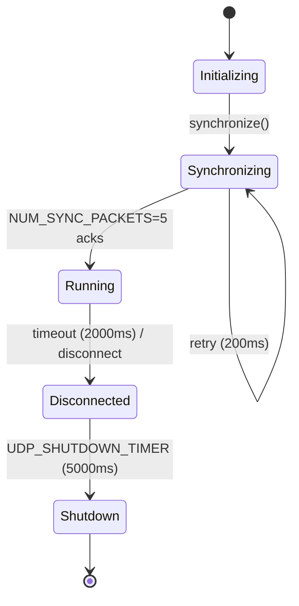

<!-- SYNC: This source doc syncs to wiki/Formal-Specification.md. -->

<p align="center">
  
</p>

# Fortress Rollback Formal Specification

**Version:** 1.1
**Date:** December 10, 2025
**Status:** Complete

This document provides a formal specification of Fortress Rollback's core components, invariants, and correctness properties. It serves as the foundation for formal verification using TLA+, Z3, and Kani.

## Changelog

- **v1.1 (Session 47 - Dec 10, 2025):** FV-GAP-6 updates
  - Added INV-9: Rollback Target Guard
  - Strengthened `load_frame()` precondition: `frame < current_frame` (was ≤)
  - Added `skip_rollback()` operation specification

---

## Table of Contents

1. [Notation](#notation)
2. [Core Types](#core-types)
3. [System Invariants](#system-invariants)
4. [Component Specifications](#component-specifications)
5. [Protocol Specifications](#protocol-specifications)
6. [Safety Properties](#safety-properties)
7. [Liveness Properties](#liveness-properties)
8. [Constants](#constants)

---

## Notation

| Symbol   | Meaning                        |
| -------- | ------------------------------ |
| `∀`      | For all                        |
| `∃`      | There exists                   |
| `∧`      | Logical AND                    |
| `∨`      | Logical OR                     |
| `¬`      | Logical NOT                    |
| `→`      | Implies                        |
| `↔`      | If and only if                 |
| `∈`      | Element of                     |
| `ℕ`      | Natural numbers (0, 1, 2, ...) |
| `ℤ`      | Integers                       |
| `[a, b]` | Closed interval from a to b    |
| `[a, b)` | Half-open interval             |
| `⊥`      | Undefined/null value           |
| `□`      | Always (temporal)              |
| `◇`      | Eventually (temporal)          |
| `○`      | Next state (temporal)          |
| `X'`     | Value of X in next state       |

---

## Core Types

### Frame

A frame represents a discrete time step in the game simulation.

```
Frame = ℤ
NULL_FRAME = -1

VALID_FRAME(f) ↔ f ≥ 0
```

**Operations:**

```
frame_add: Frame × ℤ → Frame
    frame_add(f, n) = f + n

frame_sub: Frame × Frame → ℤ
    frame_sub(f1, f2) = f1 - f2

frame_valid: Frame → Bool
    frame_valid(f) = f ≠ NULL_FRAME ∧ f ≥ 0
```

### PlayerHandle

```
PlayerHandle = ℕ
num_players: ℕ  -- configured at session creation

VALID_PLAYER(h) ↔ h ∈ [0, num_players)
VALID_SPECTATOR(h) ↔ h ≥ num_players
```

### PlayerInput

```
PlayerInput<T> = {
    frame: Frame,
    input: T
}

BLANK_INPUT(f) = PlayerInput { frame: f, input: T::default() }
```

### InputStatus

```
InputStatus = Confirmed | Predicted | Disconnected
```

### ConnectionStatus

```
ConnectionStatus = {
    disconnected: Bool,
    last_frame: Frame,
    epoch: ℕ            -- u16 monotonic per-slot generation, bumped on each
                       -- connected<->disconnected transition; rides the
                       -- connect-status gossip on every Input packet
}
```

---

## System Invariants

These invariants **MUST** hold at all times during system operation.

### INV-1: Frame Monotonicity

```
□(current_frame' ≥ current_frame ∨ IN_ROLLBACK)
```

The current frame never decreases except during explicit rollback.

### INV-2: Rollback Boundedness

```
□(rollback_depth ≤ max_prediction)
    where rollback_depth = current_frame - frame_to_load
```

### INV-3: Input Consistency (Immutability)

```
□(∀f ∈ Frame, p ∈ PlayerHandle:
    confirmed(f, p) → □(input(f, p) = input(f, p)))
```

Once confirmed, inputs never change.

### INV-4: Queue Length Bounds

```
□(∀q ∈ InputQueue: 0 ≤ q.length ≤ INPUT_QUEUE_LENGTH)
    where INPUT_QUEUE_LENGTH = 128
```

### INV-5: Queue Index Validity

```
□(∀q ∈ InputQueue:
    q.head ∈ [0, INPUT_QUEUE_LENGTH) ∧
    q.tail ∈ [0, INPUT_QUEUE_LENGTH))
```

### INV-6: State Availability

```
□(∀f ∈ [current_frame - max_prediction, current_frame]:
    state_exists(f) ∨ f < first_saved_frame)
```

### INV-7: Confirmed Frame Consistency

```
□(last_confirmed_frame ≤ current_frame)
```

### INV-8: Saved Frame Consistency

```
□(last_saved_frame ≤ current_frame)
```

### INV-9: Rollback Target Guard (Added Session 47 - FV-GAP-6)

```
□(load_frame_called(f) → f < current_frame)
```

The `load_frame()` operation is only called when the target frame is strictly
less than the current frame. When `first_incorrect_frame >= current_frame`,
`skip_rollback()` is called instead.

This invariant captures the guard in `adjust_gamestate()`:

```rust
if load_target >= current_frame {
    // skip_rollback path
    return Ok(());
}
// Only reach load_frame if load_target < current_frame
```

### INV-9a: Message Causality

```
□(∀m1, m2 ∈ Message:
    sent(m1) < sent(m2) ∧ same_peer(m1, m2) →
    received(m1) < received(m2) ∨ ¬received(m2))
```

### INV-10: Determinism

```
□(∀s1, s2 ∈ State, inputs ∈ InputSequence:
    s1 = s2 → advance(s1, inputs) = advance(s2, inputs))
```

### INV-11: No Panics

```
□(∀api_call: result ∈ {Ok(_), Err(FortressError)})
```

All public APIs return Result, never panic.

---

## Component Specifications

### InputQueue&lt;T&gt;

**State:**

```
InputQueue<T> = {
    inputs: Array<PlayerInput<T>, 128>,
    head: ℕ,                    -- next write position
    tail: ℕ,                    -- oldest valid input
    length: ℕ,                  -- valid entries count
    frame_delay: ℕ,
    first_incorrect_frame: Frame,
    last_added_frame: Frame,
    last_requested_frame: Frame,
    prediction: PlayerInput<T>
}
```

**Initial State:**

```
INIT = {
    inputs: [BLANK_INPUT(NULL_FRAME); 128],
    head: 0, tail: 0, length: 0,
    frame_delay: configured,
    first_incorrect_frame: NULL_FRAME,
    last_added_frame: NULL_FRAME,
    last_requested_frame: NULL_FRAME,
    prediction: BLANK_INPUT(NULL_FRAME)
}
```

**Operations:**

#### add_input(input) → Frame

```
PRE:
    input.frame = last_added_frame + 1 ∨ last_added_frame = NULL_FRAME

POST:
    length' = min(length + 1, 128)
    head' = (head + 1) mod 128
    last_added_frame' = input.frame
    inputs[head]' = input

RETURNS:
    input.frame (success) | NULL_FRAME (rejected)
```

#### get_input(frame) → (PlayerInput, InputStatus)

```
PRE: frame ≥ 0

POST:
    frame ≤ last_added_frame →
        RETURNS (inputs[frame mod 128], Confirmed)
    frame > last_added_frame →
        RETURNS (prediction, Predicted)
```

#### confirmed_input(frame) → Result&lt;PlayerInput, Error&gt;

```
PRE:
    frame ≤ last_added_frame
    frame ≥ last_added_frame - length + 1

POST:
    RETURNS Ok(inputs[frame mod 128])

ERROR:
    frame mismatch (no confirmed input at slot) → NoConfirmedInput (FortressError::InvalidRequestStructured)
```

#### reset_prediction()

```
POST: first_incorrect_frame' = NULL_FRAME
```

### SyncLayer&lt;T&gt;

**State:**

```
SyncLayer<T> = {
    num_players: ℕ,
    input_queues: Array<InputQueue<T>, num_players>,
    saved_states: SavedStates<T>,
    current_frame: Frame,
    last_confirmed_frame: Frame,
    last_saved_frame: Frame,
    max_prediction: ℕ,
    sparse_saving: Bool
}
```

**Operations:**

#### add_local_input(handle, input) → Result&lt;Frame, Error&gt;

```
PRE:
    VALID_PLAYER(handle)
    input_queues[handle].last_added_frame < current_frame + frame_delay

POST:
    input added to input_queues[handle]
    RETURNS Ok(frame)
```

#### add_remote_input(handle, input) → Frame

```
PRE:
    VALID_PLAYER(handle)

POST:
    -- Check prediction correctness
    old_prediction ≠ input.input ∧ first_incorrect_frame = NULL_FRAME →
        first_incorrect_frame' = input.frame
    RETURNS input_queues[handle].add_input(input)
```

#### synchronized_inputs(connect_status) → Option&lt;Vec&lt;(Input, InputStatus)&gt;&gt;

```
POST:
    result.length = num_players
    ∀p ∈ [0, num_players):
        connect_status[p].disconnected →
            result[p] = (Input::default(), Disconnected)
        ¬connect_status[p].disconnected →
            result[p] = input_queues[p].get_input(current_frame)
```

#### advance_frame()

```
POST: current_frame' = current_frame + 1
```

#### save_current_state() → SaveRequest

```
POST:
    last_saved_frame' = current_frame
    RETURNS SaveGameState { frame: current_frame, cell }
```

#### load_frame(frame) → Result&lt;LoadRequest, Error&gt;

**Updated (Session 47 - FV-GAP-6):** The precondition was strengthened to require
`frame < current_frame` (strictly less than). The case where `frame >= current_frame`
is handled by `skip_rollback()` instead.

```
PRE:
    frame ≠ NULL_FRAME
    frame < current_frame           -- STRENGTHENED: was ≤, now strictly <
    frame ≥ current_frame - max_prediction

POST:
    current_frame' = frame
    RETURNS Ok(LoadGameState { frame, cell })

ERROR:
    frame = NULL_FRAME → InvalidFrameStructured(NullFrame)        -- "cannot load NULL_FRAME"
    frame >= current_frame → InvalidFrameStructured(NotInPast)    -- "must load frame in the past (current: …)"
```

#### skip_rollback()

**Added (Session 47 - FV-GAP-6):** This operation handles the case where
`first_incorrect_frame >= current_frame`, which can occur at frame 0 when a
misprediction is detected before any frame has advanced.

```
PRE:
    first_incorrect_frame ≠ NULL_FRAME
    first_incorrect_frame >= current_frame   -- This is the trigger condition

POST:
    first_incorrect_frame' = NULL_FRAME      -- Reset prediction tracking
    -- No state change (no load_frame call)

COMMENT:
    This operation is called instead of load_frame() when the rollback
    target would be at or after the current frame. The typical scenario
    is misprediction detected at frame 0:
        first_incorrect_frame = 0, current_frame = 0

    Production code (p2p_session.rs, adjust_gamestate):
        let load_target = frame_to_load.max(window_floor); // clamp UP to prediction-window floor
        if load_target >= current_frame {
            self.sync_layer.reset_prediction();
            return Ok(());  // Skip rollback
        }
```

---

## Protocol Specifications

### UdpProtocol State Machine

```
States = { Initializing, Synchronizing, Running, Disconnected, Shutdown }
Initial = Initializing

Transitions:
    Initializing  →[synchronize()]→     Synchronizing
    Synchronizing →[sync_complete]→     Running
    Synchronizing →[timeout]→           Synchronizing  (retry)
    Running       →[timeout]→           Disconnected
    Running       →[disconnect_req]→    Disconnected
    Disconnected  →[shutdown_timer]→    Shutdown
    *             →[shutdown()]→        Shutdown
```

**State Diagram:**



### Synchronization Protocol

```
-- State
sync_remaining: ℕ = NUM_SYNC_PACKETS = 5
sync_requests: Set<u32>
handshake_failed: Option<IncompatibleSessionReason> = None
local_handshake: HandshakeConfig

-- Initiator
SEND: SyncRequest { random: rand(), handshake: local_handshake }
      sync_requests := sync_requests ∪ {random}

-- Responder (on SyncRequest)
SEND: SyncReply { random: request.random, handshake: local_handshake }
first_mismatch(local_handshake, request.handshake) != None →
    handshake_failed := first_mismatch(local_handshake, request.handshake)

-- Initiator (on SyncReply where reply.random ∈ sync_requests)
first_mismatch(local_handshake, reply.handshake) != None →
    handshake_failed := first_mismatch(local_handshake, reply.handshake)
first_mismatch(local_handshake, reply.handshake) = None → sync_remaining := sync_remaining - 1
sync_remaining = 0 → state := Running

handshake_failed != None →
    state = Synchronizing
    ∧ no further SyncRequest retries
    ∧ no SyncTimeout event
    ∧ exactly one IncompatibleSession event
    ∧ every received SyncRequest still receives local_handshake
```

`SessionConfigBlock` contains fixed-width player count, serialized input width,
FPS, maximum prediction, and desync interval fields. Compatibility floor and
feature bits are compared before the canonical digest. Mismatch precedence is
protocol floor, player count, input width, FPS, maximum prediction, desync
interval, feature bits, then digest.

### Message Types

```
MessageBody =
    | SyncRequest { random_request: u32, min_compat_version: u8, features: u32,
                    config: SessionConfigBlock, config_digest: u64 }
    | SyncReply { random_reply: u32, min_compat_version: u8, features: u32,
                  config: SessionConfigBlock, config_digest: u64 }
    | Input { peer_connect_status: Vec<ConnectionStatus>, start_frame: Frame, ack_frame: Frame, bytes: Vec<u8> }
    | InputAck { ack_frame: Frame }
    | QualityReport { frame_advantage: i16, ping: u128 }
    | QualityReply { pong: u128 }
    | ChecksumReport { checksum: u128, frame: Frame }
    | KeepAlive
    | FloorRequest { round_seq: u32 }                    -- floor-round protocol (N>=4 double-failure-relay convergence)
    | FloorReply { round_seq: u32, floors: Vec<Frame> }  -- relay's per-slot pessimistic floors
    -- Tags 10-16 are reserved in every build; their bodies are handled only with
    -- cfg(feature = "hot-join"):
    | JoinRequest { player_handle: usize }
    | StateSnapshot { ... }
    | StateSnapshotAck { ... }
    | ReactivateSlot { ... }
    | ReactivateSlotAck { ... }
    | JoinCommitted { ... }
    | JoinAborted { frame: Frame }
    | Goodbye { reason: u8 }                            -- fixed wire tag 17
```

---

## Safety Properties

### SAFE-1: No Buffer Overflow

```
□(∀q ∈ InputQueue: q.length ≤ 128)
```

### SAFE-1b: Network Input Batch Bounds

```
□(input_wire_len(Config::Input::default()) > 0)
□(∀input ∈ NetworkInput: input_wire_len(input) = input_wire_len(Config::Input::default()))
□(∀batch ∈ SentInputBatch:
    decoded_bytes(batch) ≤ min(
        pending_output_limit * input_wire_len(Config::Input::default()),
        DEFAULT_MAX_DECODED_LEN
    )
    ∧ decoded_frame_count(batch) ≤ ProtocolConfig::MAX_PENDING_OUTPUT_LIMIT)
□(∀poll ∈ SocketReceivePoll:
    raw_receive_attempt_count(poll) ≤ MAX_RECEIVE_MESSAGES_PER_POLL
    ∧ decoded_message_count(poll) ≤ MAX_RECEIVE_MESSAGES_PER_POLL)
```

### SAFE-1c: Stream Frame and Datagram Diagnostic Bounds

```
□(∀frame ∈ AcceptedStreamFrames:
    0 < declared_payload_len(frame) ≤ DEFAULT_MAX_FRAME_LEN
    ∧ decoded_message_bytes(frame) = declared_payload_len(frame))
□(∀push ∈ StreamDecoderPushes:
    yielded_message_count(push) ≤ 1
    ∧ buffered_frame_count(push) ≤ 1)
□(∀msg ∈ QueuedUdpMessages:
    encoded_len(msg) ≥ 1200 ⇒ portability_risk_messages_sent' =
        saturating_increment(portability_risk_messages_sent))
□(∀msg ∈ QueuedUdpMessages:
    encoded_len(msg) ≥ 1472 ⇒ fragmentation_risk_messages_sent' =
        saturating_increment(fragmentation_risk_messages_sent))
```

The 1,200- and 1,472-byte rules are telemetry, not acceptance bounds: endpoints still queue a
valid message, while diagnosing each threshold once per endpoint era. The stream prefix is a transport envelope and therefore does
not alter the deterministic protocol-v1 message format.

### SAFE-2: No Invalid Frame Access

```
□(∀access(f): f = NULL_FRAME ∨ f ∈ [0, current_frame + max_prediction])
```

### SAFE-3: No State Loss

```
□(∀f ∈ [current_frame - max_prediction, current_frame]:
    needs_rollback(f) → state_loadable(f))
```

### SAFE-4: Rollback Consistency

```
□(load_frame(f) → ○(game_state = saved_state(f)))
```

### SAFE-5: No Deadlock

```
□(state ≠ Shutdown → ◇(can_progress ∨ state = Shutdown))
```

### SAFE-6: No Integer Overflow

```
□(∀f ∈ Frame, n ∈ ℤ: |f + n| < 2^31 - 1)
```

### SAFE-7: Checksum Integrity

```
□(desync_detection = On →
    checksum_compare(f) only when ∀p: confirmed(f, p))
```

---

## Liveness Properties

### LIVE-1: Eventual Synchronization

```
□(network_available → ◇(∀p ∈ Peer: p.state = Running))
```

### LIVE-2: Input Confirmation

```
□(predicted(f, p) ∧ ¬disconnected(p) → ◇(confirmed(f, p)))
```

### LIVE-3: Progress

```
□(∃p: connected(p) → ◇(current_frame' > current_frame))
```

### LIVE-4: Rollback Completion

```
□(IN_ROLLBACK → ◇(¬IN_ROLLBACK))
```

### LIVE-5: Disconnect Detection

```
□(network_failed(p, duration > DISCONNECT_TIMEOUT) → ◇(disconnected(p)))
```

### LIVE-6: Spectator Catch-up

```
□(spectator_behind(n) ∧ n > MAX_FRAMES_BEHIND →
    ◇(spectator_behind(m) ∧ m < n))
```

### SAFE-12: Coordinated graceful-drop history immutability

The protocol-v1 graceful-removal implementation under review is a distributed
barrier, not an immediate local freeze. Each survivor first holds its
exposed-confirmed high-water and reports that value plus every target's receipt
and retained input range. The certified cut is the maximum over every reported
exposed frame and every reported target receipt. Bounded, value-bearing
backfill closes each receipt-to-cut gap before a survivor becomes ready. A
commit is applied atomically at each survivor and is idempotent, relayed, and
fenced by the exact target generation and operation ID.

For every survivor `p`, committed cut `C`, and frame `f` already exposed by
`p`, the public target input remains the canonical input:

```
committed(p, C) ∧ f ≤ exposed_high_water(p) → reported_input(p, f) = input(f)
```

`specs/tla/CoordinatedPeerDrop.tla` models two serialized operation IDs over two
membership/target eras with independent per-survivor commit. The runtime defers
a prepare received while a prior commit closes, discards its stale participant
vector after membership changes, and re-derives the intent in the current era;
the bounded model represents this as `RebaseNextMembershipEra` and rejects
messages carrying an older era. The base safety model permits reordered
delivery; explicit handlers cover duplicate backfill/commit and stale-era
messages. Its receipt witness requires the certified cut to rise strictly above
every exposed high-water because one reported receipt is higher. Its enforced
`ImmediateMin` mutation demonstrates D14: choosing the minimum receipt can
freeze below another survivor's exposed high-water and rewrite confirmed
history.

The `CoordinatedPeerDrop_Fair.cfg` companion assumes fault-free fair progress
and proves both operations resolve, including receipt-raised cut selection,
membership-era rebasing, positive backfill, duplicate handling, and stale-era
rejection. The
`CoordinatedPeerDrop_Faults.cfg` companion permits arbitrary message loss and
models timeout, missing retained history, exhausted backfill budget,
conflicting overlap, participant loss, and generation drift. Once any survivor
prepares, explicit fairness of a terminal fault and `Fail` propagation proves
every survivor eventually fails closed; no success liveness is claimed under
permanent loss. This fault claim is deliberately pre-commit: after a survivor
applies a certified commit, timeout only closes its bounded retransmission
journal and participant loss cannot revert the emitted drop. The model likewise
excludes `Committed` from timeout, participant-loss, and `Fail` transitions.
The model covers one target input stream and two fixed survivor identities;
changing participant cardinality and multi-handle endpoint composition remain
implementation/test obligations.

---

## Constants

| Constant                     | Value         | Description                                                     |
| ---------------------------- | ------------- | --------------------------------------------------------------- |
| `INPUT_QUEUE_LENGTH`         | 128           | Max inputs per player queue                                     |
| `NULL_FRAME`                 | -1            | Invalid/uninitialized frame sentinel                            |
| `NUM_SYNC_PACKETS`           | 5             | Sync roundtrips before Running                                  |
| `pending_output_limit`       | 128 (default) | Max pending output messages and decoded input frames (bounded by `ProtocolConfig::MAX_PENDING_OUTPUT_LIMIT`) |
| `DEFAULT_MAX_DECODED_LEN`    | 64 MiB        | Hard cap for RLE decoded bytes before delta frame splitting             |
| `MAX_RECEIVE_MESSAGES_PER_POLL` | 256        | Built-in socket receive-poll raw attempt and decoded message cap        |
| `UDP_SHUTDOWN_TIMER`         | 5000ms        | Disconnected → Shutdown delay                                   |
| `SYNC_RETRY_INTERVAL`        | 200ms         | Sync packet retry interval                                      |
| `KEEP_ALIVE_INTERVAL`        | 200ms         | Keep-alive interval                                             |
| `QUALITY_REPORT_INTERVAL`    | 200ms         | Network quality report interval                                 |
| `MAX_CHECKSUM_HISTORY`       | 32            | Checksums for desync detection                                  |
| `SPECTATOR_BUFFER_SIZE`      | 60            | Spectator input buffer                                          |
| `DEFAULT_MAX_PREDICTION`     | 8             | Default prediction window                                       |
| `DEFAULT_DISCONNECT_TIMEOUT` | 2000ms        | Default peer timeout                                            |
| `DEFAULT_FPS`                | 60            | Default frame rate                                              |

---

## Verification Targets

| Property                      | Tool | Status                                           |
| ----------------------------- | ---- | ------------------------------------------------ |
| INV-4, INV-5 (queue bounds)   | Kani | ✅ Implemented                                    |
| SAFE-1 (no overflow)          | Kani | ✅ Implemented                                    |
| SAFE-6 (no int overflow)      | Kani | ✅ Implemented                                    |
| Protocol-state enum representation | Kani | ✅ Implemented (`src/network/protocol/state.rs`) |
| Production state transitions | Rust tests | ✅ Implemented (`src/network/protocol/mod.rs`) |
| Bounded config-handshake safety and fair-delivery convergence | TLA+ | ✅ Implemented (`specs/tla/SyncHandshakeV1*.tla`) |
| SAFE-4 (rollback consistency) | TLA+ | ✅ Implemented (`specs/tla/Rollback.tla`)         |
| Frame arithmetic              | Z3   | ✅ Implemented (`tests/verification/z3.rs`)       |
| Queue index math              | Z3   | ✅ Implemented (`tests/verification/z3.rs`)       |
| Concurrency (GameStateCell)   | Loom | ✅ Implemented (`loom-tests/`)                    |
| Time synchronization          | TLA+ | ✅ Implemented (`specs/tla/TimeSync.tla`)         |
| Checksum exchange             | TLA+ | ✅ Implemented (`specs/tla/ChecksumExchange.tla`) |
| Spectator session             | TLA+ | ✅ Implemented (`specs/tla/SpectatorSession.tla`) |
| Concurrency model             | TLA+ | ✅ Implemented (`specs/tla/Concurrency.tla`)      |
| Graceful-drop barrier model | TLA+ | ✅ Implemented (`specs/tla/CoordinatedPeerDrop.tla`) |

---

## Revision History

| Version | Date       | Changes                                                      |
| ------- | ---------- | ------------------------------------------------------------ |
| 1.1     | 2026-07-12 | Added the coordinated graceful-drop safety model and D14 mutation gate |
| 1.0     | 2025-12-06 | Complete specification with invariants, components, protocol |
| 0.1     | 2025-12-06 | Initial draft                                                |
