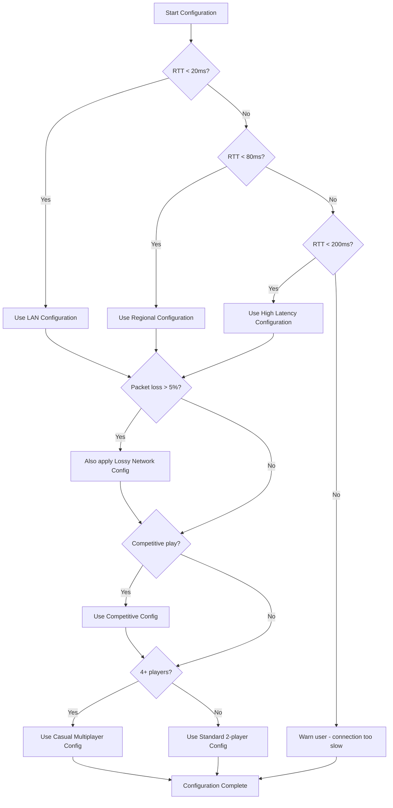

<!-- SYNC: This file should be kept in sync with wiki/User-Guide.md -->

<p align="center">
  
</p>

# Fortress Rollback User Guide

This guide walks you through integrating Fortress Rollback into your game. By the end, you'll understand how to set up sessions, handle inputs, manage game state, and respond to network events.

## Table of Contents

1. [Quick Start](#quick-start)
2. [Defining Your Config](#defining-your-config)
3. [Setting Up a P2P Session](#setting-up-a-p2p-session)
4. [Player Handle Convenience Methods](#player-handle-convenience-methods)
5. [The Game Loop](#the-game-loop)
6. [Handling Requests](#handling-requests)
7. [Handling Events](#handling-events)
8. [Determinism Requirements](#determinism-requirements)
9. [Network Requirements](#network-requirements)
   - [Network Scenario Configuration Guide](#network-scenario-configuration-guide)
     - [LAN / Local Network](#lan--local-network--20ms-rtt)
     - [Regional Internet](#regional-internet-20-80ms-rtt)
     - [High Latency](#high-latency-80-200ms-rtt)
     - [Lossy Network](#lossy-network-5-15-packet-loss)
     - [Competitive/Tournament](#competitivetournament-strict-requirements)
     - [Casual Multiplayer](#casual-multiplayer-4-players)
     - [Spectator Streaming](#spectator-streaming)
     - [Network Quality Monitoring](#network-quality-monitoring)
10. [Advanced Configuration](#advanced-configuration)
    - [ChaosSocket for Testing](#chaossocket-for-testing)
    - [ChaosConfig Presets](#chaosconfig-presets)
    - [ChaosStats](#chaosstats)
    - [SessionState](#sessionstate)
    - [Prediction Strategies](#prediction-strategies)
11. [Feature Flags](#feature-flags)
    - [Feature Flag Reference](#feature-flag-reference)
    - [Feature Flag Combinations](#feature-flag-combinations)
    - [Web / WASM Integration](#web--wasm-integration)
    - [Platform-Specific Features](#platform-specific-features)
12. [Spectator Sessions](#spectator-sessions)
13. [Testing with SyncTest](#testing-with-synctest)
14. [Common Patterns](#common-patterns)
15. [Common Pitfalls](#common-pitfalls)
    - [Session Termination Anti-Pattern](#session-termination-the-last_confirmed_frame-anti-pattern)
    - [Desync Detection Defaults](#understanding-desync-detection-defaults)
    - [NetworkStats Checksum Fields](#networkstats-checksum-fields-for-desync-detection)
16. [Desync Detection and SyncHealth API](#desync-detection-and-synchealth-api)
17. [Troubleshooting](#troubleshooting)

---

## Quick Start

Here's a minimal example to get you started:

```rust
use fortress_rollback::{
    Config, FortressRequest, Frame, InputStatus, NonBlockingSocket,
    PlayerHandle, PlayerType, SessionBuilder, SessionState,
    UdpNonBlockingSocket,
};
use serde::{Deserialize, Serialize};
use std::net::SocketAddr;

// 1. Define your input type
#[derive(Copy, Clone, PartialEq, Default, Serialize, Deserialize)]
struct MyInput {
    buttons: u8,
}

// 2. Define your game state (Clone required for rollback, Serialize/Deserialize needed for checksums)
#[derive(Clone, Serialize, Deserialize)]
struct MyGameState {
    frame: i32,
    player_x: f32,
    player_y: f32,
}

// 3. Create your config type
struct MyConfig;
impl Config for MyConfig {
    type Input = MyInput;
    type State = MyGameState;
    type Address = SocketAddr;
}

fn main() -> Result<(), Box<dyn std::error::Error>> {
    // 4. Create a session
    let socket = UdpNonBlockingSocket::bind_to_port(7000)?;
    let remote_addr: SocketAddr = "127.0.0.1:7001".parse()?;

    let mut session = SessionBuilder::<MyConfig>::new()
        .with_num_players(2)?
        .add_player(PlayerType::Local, PlayerHandle::new(0))?
        .add_player(PlayerType::Remote(remote_addr), PlayerHandle::new(1))?
        .start_p2p_session(socket)?;

    // 5. Game loop
    let mut game_state = MyGameState {
        frame: 0,
        player_x: 0.0,
        player_y: 0.0,
    };

    loop {
        // Poll for network messages
        session.poll_remote_clients();

        // Only process frames when synchronized
        if session.current_state() == SessionState::Running {
            // Add local input
            // Tip: For cleaner player handle management, see the
            // "Player Handle Convenience Methods" section below
            let input = MyInput { buttons: 0 }; // Get real input here
            session.add_local_input(PlayerHandle::new(0), input)?;

            // Advance the frame
            for request in session.advance_frame()? {
                match request {
                    FortressRequest::SaveGameState { cell, frame } => {
                        cell.save(frame, Some(game_state.clone()), None);
                    }
                    FortressRequest::LoadGameState { cell, .. } => {
                        // LoadGameState is only requested for previously saved frames
                        if let Some(state) = cell.load() {
                            game_state = state;
                        }
                    }
                    FortressRequest::AdvanceFrame { inputs } => {
                        // Apply inputs to your game state
                        game_state.frame += 1;
                        // ... update game_state based on inputs
                    }
                }
            }
        }

        // Render and sleep...
    }
}
```

> **📚 See Also — Reduce Boilerplate & Catch Bugs**
>
> - **[`handle_requests!` macro](#using-the-handle_requests-macro)** — Eliminate match boilerplate with a concise macro
> - **[`compute_checksum()`](#computing-checksums)** — Enable desync detection with built-in deterministic hashing
> - **[Config Presets](#syncconfig-presets)** — Use `SyncConfig::lan()`, `ProtocolConfig::competitive()`, etc. for common network conditions
> - **[Request Handling Example](../examples/request_handling.rs)** — Complete example showing both manual matching and macro usage

---

## Defining Your Config

The `Config` trait bundles all type parameters for your session:

```rust
use fortress_rollback::Config;
use serde::{Deserialize, Serialize};
use std::net::SocketAddr;

// Your input type - sent over the network
#[repr(C)]
#[derive(Copy, Clone, PartialEq, Default, Serialize, Deserialize)]
pub struct GameInput {
    pub buttons: u8,
    pub stick_x: i8,
    pub stick_y: i8,
}

// Your game state - saved and loaded during rollback
#[derive(Clone, Serialize, Deserialize)]
pub struct GameState {
    pub frame: i32,
    pub players: Vec<PlayerState>,
    // ... all your game data
}

// Your config type
pub struct GameConfig;

impl Config for GameConfig {
    type Input = GameInput;
    type State = GameState;
    type Address = SocketAddr; // Or your custom address type
}
```

### Input Type Requirements

Your input type must:

- Be `Copy + Clone + PartialEq`
- Implement `Default` (used for disconnected players)
- Implement `Serialize + Deserialize` (for network transmission)

**Tips:**

- Keep inputs small; they're sent every frame
- Use bitflags for button states
- Consider `#[repr(C)]` for consistent serialization

### State Type Requirements

Your state type requirements depend on feature flags:

- **Default** (no `sync-send`): No compile-time bounds on `State`, but `Clone` is required in practice for `GameStateCell::load()` during rollback
- **With `sync-send` feature**: `State` must be `Clone + Send + Sync`

**Optional but recommended:**

- Implement `Serialize + Deserialize` for checksums

---

## Setting Up a P2P Session

Use `SessionBuilder` to configure and create sessions:

```rust
use fortress_rollback::{
    DesyncDetection, PlayerHandle, PlayerType, SessionBuilder,
    UdpNonBlockingSocket,
};
use web_time::Duration;

let socket = UdpNonBlockingSocket::bind_to_port(7000)?;
let remote_addr = "192.168.1.100:7000".parse()?;

let mut session = SessionBuilder::<GameConfig>::new()
    // Number of active players (not spectators)
    .with_num_players(2)?

    // Frames of input delay (reduces rollbacks, adds latency)
    .with_input_delay(2)?

    // How many frames ahead we can predict
    .with_max_prediction_window(8)

    // Expected frames per second
    .with_fps(60)?

    // Enable desync detection (compare checksums every 100 frames)
    .with_desync_detection_mode(DesyncDetection::On { interval: 100 })

    // Network timeouts
    .with_disconnect_timeout(Duration::from_millis(3000))
    .with_disconnect_notify_delay(Duration::from_millis(500))

    // Add players
    .add_player(PlayerType::Local, PlayerHandle::new(0))?
    .add_player(PlayerType::Remote(remote_addr), PlayerHandle::new(1))?

    // Start the session
    .start_p2p_session(socket)?;
```

### Understanding Input Delay

Input delay trades responsiveness for smoothness:

| Delay | Effect |
|-------|--------|
| 0 | Immediate response, frequent rollbacks |
| 2 | Slight delay, fewer rollbacks |
| 4+ | Noticeable delay, rare rollbacks |

A delay of 2 frames is a good starting point for most games.

### Lockstep Mode

Set `max_prediction_window(0)` for lockstep networking:

```rust
let session = SessionBuilder::<GameConfig>::new()
    .with_max_prediction_window(0) // Lockstep mode
    .with_input_delay(0)?          // No delay needed
    // ...
```

In lockstep mode:

- No rollbacks ever occur
- No save/load requests
- Frame rate limited by slowest connection
- Good for turn-based or slower-paced games

---

## Player Handle Convenience Methods

Once you've added players to a session, you'll often need to work with their handles—for adding inputs, checking player types, or iterating over specific player groups. Fortress Rollback provides convenience methods that make common patterns cleaner and less error-prone.

### Two-Player Games (1v1)

For the typical 1v1 networked game with one local and one remote player:

```rust
# use fortress_rollback::{FortressError, PlayerHandle};
# struct Session;
# impl Session {
#     fn local_player_handle_required(&self) -> Result<PlayerHandle, FortressError> { Ok(PlayerHandle::new(0)) }
#     fn remote_player_handle_required(&self) -> Result<PlayerHandle, FortressError> { Ok(PlayerHandle::new(1)) }
#     fn add_local_input(&mut self, h: PlayerHandle, i: u8) -> Result<(), FortressError> { Ok(()) }
#     fn network_stats(&self, h: PlayerHandle) -> Result<Stats, FortressError> { Ok(Stats) }
# }
# struct Stats;
# fn get_local_input() -> u8 { 0 }
# fn main() -> Result<(), FortressError> {
# let mut session = Session;
// Get the single local player's handle (returns error if not exactly 1)
let local = session.local_player_handle_required()?;
session.add_local_input(local, get_local_input())?;

// Get the single remote player's handle for stats
let remote = session.remote_player_handle_required()?;
let stats = session.network_stats(remote)?;
# Ok(())
# }
```

The `*_required()` methods return an error if there isn't exactly one player of that type, catching configuration mistakes early.

### Multi-Player Games

For games with multiple local players (couch co-op) or multiple remotes:

```rust
# use fortress_rollback::{FortressError, PlayerHandle};
# use fortress_rollback::HandleVec;
# struct Session;
# impl Session {
#     fn local_player_handles(&self) -> HandleVec { HandleVec::new() }
#     fn remote_player_handles(&self) -> HandleVec { HandleVec::new() }
#     fn add_local_input(&mut self, h: PlayerHandle, i: u8) -> Result<(), FortressError> { Ok(()) }
#     fn network_stats(&self, h: PlayerHandle) -> Result<Stats, FortressError> { Ok(Stats) }
# }
# struct Stats { ping: u32 }
# fn get_input_for_controller(i: usize) -> u8 { 0 }
# fn main() -> Result<(), FortressError> {
# let mut session = Session;
// Add input for all local players (e.g., two controllers on one machine)
for (i, handle) in session.local_player_handles().into_iter().enumerate() {
    let input = get_input_for_controller(i);
    session.add_local_input(handle, input)?;
}

// Check network stats for all remote players
for handle in session.remote_player_handles() {
    let stats = session.network_stats(handle)?;
    if stats.ping > 150 {
        println!("High latency with player {:?}", handle);
    }
}
# Ok(())
# }
```

### Checking Player Types

When you need to handle different player types differently:

```rust
# use fortress_rollback::{PlayerHandle, PlayerType};
# use std::net::SocketAddr;
# use fortress_rollback::HandleVec;
# struct Session;
# impl Session {
#     fn all_player_handles(&self) -> HandleVec { HandleVec::new() }
#     fn is_local_player(&self, h: PlayerHandle) -> bool { false }
#     fn is_remote_player(&self, h: PlayerHandle) -> bool { false }
#     fn is_spectator_handle(&self, h: PlayerHandle) -> bool { false }
#     fn player_type(&self, h: PlayerHandle) -> Option<PlayerType<SocketAddr>> { None }
# }
# fn main() {
# let session = Session;
// Iterate all handles and branch by type
for handle in session.all_player_handles() {
    if session.is_local_player(handle) {
        // Add local input
    } else if session.is_remote_player(handle) {
        // Show network indicator in UI
    } else if session.is_spectator_handle(handle) {
        // Show spectator badge
    }
}

// Or use player_type() for full details
for handle in session.all_player_handles() {
    match session.player_type(handle) {
        Some(PlayerType::Local) => println!("Local player: {:?}", handle),
        Some(PlayerType::Remote(addr)) => println!("Remote at {}: {:?}", addr, handle),
        Some(PlayerType::Spectator(addr)) => println!("Spectator at {}: {:?}", addr, handle),
        None => {} // Handle not found
    }
}
# }
```

### Counting Players

For matchmaking UI or game logic that depends on player counts:

```rust
# struct Session;
# impl Session {
#     fn num_local_players(&self) -> usize { 1 }
#     fn num_remote_players(&self) -> usize { 1 }
# }
# fn main() {
# let session = Session;
let local_count = session.num_local_players();
let remote_count = session.num_remote_players();

if local_count > 1 {
    println!("Local co-op mode with {} players", local_count);
}
println!("Connected to {} remote players", remote_count);
# }
```

### SyncTestSession Methods

`SyncTestSession` has similar methods for consistency, though all players are local:

```rust
# use fortress_rollback::{FortressError, PlayerHandle, SyncTestSession};
# use std::net::SocketAddr;
# struct TestConfig;
# impl fortress_rollback::Config for TestConfig {
#     type Input = u8;
#     type State = ();
#     type Address = SocketAddr;
# }
# fn main() -> Result<(), FortressError> {
let session: SyncTestSession<TestConfig> =
    fortress_rollback::SessionBuilder::new()
        .with_num_players(1)?
        .start_synctest_session()?;

// Single-player sync test
let handle = session.local_player_handle_required()?;

// Multi-player sync test
let all_handles = session.local_player_handles();
# Ok(())
# }
```

### Method Reference

| Method | Returns | Use Case |
|--------|---------|----------|
| `local_player_handle()` | `Option<PlayerHandle>` | First local player (if any) |
| `local_player_handle_required()` | `Result<PlayerHandle>` | Single local player or error |
| `local_player_handles()` | `HandleVec` | All local players |
| `remote_player_handle()` | `Option<PlayerHandle>` | First remote player (if any) |
| `remote_player_handle_required()` | `Result<PlayerHandle>` | Single remote player or error |
| `remote_player_handles()` | `HandleVec` | All remote players |
| `is_local_player(handle)` | `bool` | Check if handle is local |
| `is_remote_player(handle)` | `bool` | Check if handle is remote |
| `is_spectator_handle(handle)` | `bool` | Check if handle is spectator |
| `spectator_handles()` | `HandleVec` | All spectator handles |
| `player_type(handle)` | `Option<PlayerType>` | Full type info for handle |
| `num_local_players()` | `usize` | Count of local players |
| `num_remote_players()` | `usize` | Count of remote players |
| `all_player_handles()` | `HandleVec` | All handles (local + remote + spectators) |

---

## The Game Loop

A typical game loop with Fortress Rollback:

```rust
use web_time::{Duration, Instant};

const FPS: f64 = 60.0;
let frame_duration = Duration::from_secs_f64(1.0 / FPS);

let mut last_update = Instant::now();
let mut accumulator = Duration::ZERO;

loop {
    // 1. Network polling (do this frequently)
    session.poll_remote_clients();

    // 2. Handle events
    for event in session.events() {
        handle_event(event);
    }

    // 3. Fixed timestep accumulator
    let now = Instant::now();
    accumulator += now - last_update;
    last_update = now;

    // 4. Adjust for frame advantage (optional, helps sync)
    let mut adjusted_duration = frame_duration;
    if session.frames_ahead() > 0 {
        adjusted_duration = Duration::from_secs_f64(1.0 / FPS * 1.1);
    }

    // 5. Process frames
    while accumulator >= adjusted_duration {
        accumulator -= adjusted_duration;

        if session.current_state() == SessionState::Running {
            // Add input for all local players
            for handle in session.local_player_handles() {
                let input = get_local_input(handle);
                session.add_local_input(handle, input)?;
            }

            // Advance and handle requests
            let requests = session.advance_frame()?;
            handle_requests(requests, &mut game_state);
        }
    }

    // 6. Render
    render(&game_state);

    // 7. Sleep/wait
    std::thread::sleep(Duration::from_millis(1));
}
```

### Important: Order Matters

1. Call `poll_remote_clients()` before checking state or adding input
2. Add input for **all** local players before calling `advance_frame()`
3. Process **all** requests in the order received

---

## Handling Requests

Requests are returned by `advance_frame()` and must be processed in order.

> **💡 Exhaustive Matching — No Wildcard Needed**
>
> `FortressRequest` is **not** marked `#[non_exhaustive]`, so you can match all variants
> without a wildcard `_ =>` arm. The compiler will notify you if new variants are added
> in future versions, ensuring your code stays up-to-date.

```rust
use fortress_rollback::{FortressRequest, compute_checksum};

fn handle_requests(
    requests: Vec<FortressRequest<GameConfig>>,
    game_state: &mut GameState,
) {
    for request in requests {
        match request {
            FortressRequest::SaveGameState { cell, frame } => {
                // Optionally verify frame consistency (use debug_assert in tests only)
                debug_assert_eq!(game_state.frame, frame.as_i32());

                // Clone your state
                let state_copy = game_state.clone();

                // Compute a checksum for desync detection
                let checksum = compute_checksum(game_state).ok();

                // Save it
                cell.save(frame, Some(state_copy), checksum);
            }

            FortressRequest::LoadGameState { cell, frame } => {
                // LoadGameState is only requested for previously saved frames.
                // Missing state indicates a library bug, but we handle gracefully.
                if let Some(loaded) = cell.load() {
                    *game_state = loaded;
                    // Optionally verify frame consistency (use debug_assert in tests only)
                    debug_assert_eq!(game_state.frame, frame.as_i32());
                } else {
                    // This should never happen - log for debugging
                    eprintln!("WARNING: LoadGameState for frame {frame:?} but no state found");
                }
            }

            FortressRequest::AdvanceFrame { inputs } => {
                // Process inputs for all players
                for (player_idx, (input, status)) in inputs.iter().enumerate() {
                    match status {
                        InputStatus::Confirmed => {
                            // This input is definitely correct
                        }
                        InputStatus::Predicted => {
                            // This input might be wrong (rollback may follow)
                        }
                        InputStatus::Disconnected => {
                            // Player disconnected; input is default value
                            // You might want to use AI or freeze this player
                        }
                    }
                    apply_input(game_state, player_idx, *input, *status);
                }

                // Advance your frame counter
                game_state.frame += 1;
            }
        }
    }
}
```

### Using the `handle_requests!` Macro

For simpler cases, you can use the `handle_requests!` macro to reduce boilerplate:

```rust
use fortress_rollback::{
    handle_requests, compute_checksum, FortressRequest, Frame, GameStateCell, InputVec,
};

fn handle_requests_simple(
    requests: Vec<FortressRequest<GameConfig>>,
    game_state: &mut GameState,
) {
    handle_requests!(
        requests,
        save: |cell: GameStateCell<GameState>, frame: Frame| {
            let checksum = compute_checksum(game_state).ok();
            cell.save(frame, Some(game_state.clone()), checksum);
        },
        load: |cell: GameStateCell<GameState>, frame: Frame| {
            // LoadGameState is only requested for previously saved frames.
            // Missing state indicates a library bug, but we handle gracefully.
            if let Some(loaded) = cell.load() {
                *game_state = loaded;
            } else {
                eprintln!("WARNING: LoadGameState for frame {frame:?} but no state found");
            }
        },
        advance: |inputs: InputVec<Input>| {
            for (_input, _status) in inputs.iter() {
                // Apply input
            }
            game_state.frame += 1;
        }
    );
}
```

The macro handles all three request types and processes them in order. For lockstep mode (where save/load never occur), you can provide empty handlers:

```rust
handle_requests!(
    requests,
    save: |_, _| { /* Never called in lockstep */ },
    load: |_, _| { /* Never called in lockstep */ },
    advance: |inputs: InputVec<Input>| {
        game_state.frame += 1;
    }
);
```

### Computing Checksums

Checksums enable desync detection. Fortress Rollback provides built-in functions
for deterministic checksum computation:

```rust
use fortress_rollback::compute_checksum;
use serde::Serialize;

#[derive(Serialize)]
struct GameState {
    frame: u32,
    players: Vec<Player>,
}

// One-liner checksum computation (returns Result)
let checksum = compute_checksum(&game_state)?;

// Use in SaveGameState handler
cell.save(frame, Some(game_state.clone()), Some(checksum));
```

The `compute_checksum` function:

1. Serializes your state using bincode with fixed-integer encoding (platform-independent)
2. Hashes the bytes using FNV-1a (deterministic, no random seeds)
3. Returns a `u128` checksum matching the `cell.save()` signature

#### Alternative: Fletcher-16

For a faster but weaker checksum, use `compute_checksum_fletcher16`:

```rust
use fortress_rollback::compute_checksum_fletcher16;

// Faster, simpler checksum (16-bit result stored as u128)
let checksum = compute_checksum_fletcher16(&game_state)?;
```

#### Manual Checksumming

For advanced use cases, you can compute checksums manually using the lower-level utilities:

```rust
use fortress_rollback::checksum::{hash_bytes_fnv1a, fletcher16};
use fortress_rollback::network::codec::encode;

// Serialize state to bytes
let bytes = encode(&game_state)?;

// Hash with FNV-1a (64-bit hash as u128)
let fnv_checksum = hash_bytes_fnv1a(&bytes);

// Or use Fletcher-16 (16-bit checksum)
let fletcher_checksum = u128::from(fletcher16(&bytes));
```

> **Note:** The `network::codec` module uses a fixed-integer bincode configuration that ensures deterministic serialization across platforms. This is the same configuration used internally for network messages.

---

## Handling Events

Events notify you of network conditions:

```rust
use fortress_rollback::FortressEvent;

fn handle_event(event: FortressEvent<GameConfig>) {
    match event {
        FortressEvent::Synchronizing {
            addr,
            total,
            count,
            total_requests_sent,
            elapsed_ms,
        } => {
            println!("Syncing with {}: {}/{}", addr, count, total);
            // High total_requests_sent indicates packet loss during sync
            if total_requests_sent > count * 2 {
                println!("Warning: sync retries detected, possible packet loss");
            }
            // Monitor sync duration for network quality assessment
            if elapsed_ms > 2000 {
                println!("Warning: sync taking {}ms", elapsed_ms);
            }
        }

        FortressEvent::Synchronized { addr } => {
            println!("Synchronized with {}", addr);
        }

        FortressEvent::Disconnected { addr } => {
            println!("Disconnected from {}", addr);
            // Handle disconnection (show UI, pause game, etc.)
        }

        FortressEvent::NetworkInterrupted { addr, disconnect_timeout } => {
            println!(
                "Connection to {} interrupted, disconnecting in {}ms",
                addr, disconnect_timeout
            );
        }

        FortressEvent::NetworkResumed { addr } => {
            println!("Connection to {} resumed", addr);
        }

        FortressEvent::WaitRecommendation { skip_frames } => {
            println!("Recommendation: wait {} frames", skip_frames);
            // Optionally slow down to let others catch up
        }

        FortressEvent::DesyncDetected {
            frame,
            local_checksum,
            remote_checksum,
            addr,
        } => {
            eprintln!(
                "DESYNC at frame {} with {}! Local: {}, Remote: {}",
                frame, addr, local_checksum, remote_checksum
            );
            // This is bad! Debug your determinism.
        }

        FortressEvent::SyncTimeout { addr, elapsed_ms } => {
            eprintln!(
                "Sync timeout with {} after {}ms",
                addr, elapsed_ms
            );
            // Session continues trying, but you may choose to abort
        }
    }
}
```

---

## Determinism Requirements

**Rollback networking requires deterministic simulation.** The same inputs must always produce the same outputs.

### Common Determinism Issues

| Issue | Solution |
|-------|----------|
| Floating-point differences | Use fixed-point math, or be very careful |
| Random numbers | Use seeded RNG, sync seed across clients |
| HashMap iteration order | Use `BTreeMap` instead |
| System time | Only use frame number, not wall clock |
| Uninitialized memory | Initialize all state |
| Different library versions | Ensure all clients use same code |

### Testing Determinism

Use `SyncTestSession` to verify your game is deterministic:

```rust
let mut session = SessionBuilder::<GameConfig>::new()
    .with_num_players(1)?
    .with_check_distance(2)  // How many frames to resimulate
    .start_synctest_session()?;

// Run your game loop
// Session will rollback every frame and compare checksums
// Mismatches indicate non-determinism!
```

---

## Network Requirements

Rollback networking works best under certain network conditions. Understanding these requirements helps you configure Fortress Rollback appropriately and set player expectations.

### Supported Network Conditions

| Condition | Supported Range | Optimal | Notes |
|-----------|-----------------|---------|-------|
| **Round-Trip Time (RTT)** | <200ms | <100ms | Higher RTT = more rollbacks |
| **Packet Loss** | <15% | <5% | Above 15% causes frequent desyncs |
| **Jitter** | <50ms | <20ms | High jitter causes prediction failures |
| **Bandwidth** | >56 kbps | >256 kbps | Per-connection requirement |

### Condition Effects

**Low Latency (LAN, <20ms RTT)**

- Minimal rollbacks
- Very responsive gameplay
- Use `SyncConfig::lan()` preset for faster connection

**Medium Latency (Regional, 20-80ms RTT)**

- Occasional rollbacks
- Generally smooth gameplay
- Default configuration works well

**High Latency (Intercontinental, 80-200ms RTT)**

- Frequent rollbacks
- Noticeable input delay recommended (2-3 frames)
- Use `SyncConfig::high_latency()` preset
- Consider increasing `max_prediction_frames`

**Very High Latency (>200ms RTT)**

- May experience frequent sync failures
- Gameplay quality significantly degraded
- Not recommended for competitive play

### Conditions to Avoid

| Condition | Problem | Mitigation |
|-----------|---------|------------|
| Packet loss >15% | Frequent sync failures, desyncs | Use wired connection, improve network |
| Jitter >50ms | Prediction failures, stuttering | QoS settings, reduce network congestion |
| Asymmetric routes | One player experiences more rollbacks | Cannot mitigate at application level |
| NAT traversal issues | Connection failures | Use STUN/TURN, port forwarding |
| Mobile networks | High variability | WiFi recommended over cellular |

### SyncConfig Presets

Fortress Rollback provides configuration presets for different network scenarios:

```rust
use fortress_rollback::{SessionBuilder, SyncConfig};

// Default: Balanced for typical internet connections
let session = SessionBuilder::<GameConfig>::new()
    .with_sync_config(SyncConfig::default())
    // ...

// LAN: Fast connection for local networks
let session = SessionBuilder::<GameConfig>::new()
    .with_sync_config(SyncConfig::lan())
    // ...

// High Latency: More tolerant for 100-200ms RTT connections
let session = SessionBuilder::<GameConfig>::new()
    .with_sync_config(SyncConfig::high_latency())
    // ...

// Lossy: More retries for 5-15% packet loss environments
let session = SessionBuilder::<GameConfig>::new()
    .with_sync_config(SyncConfig::lossy())
    // ...

// Mobile: High tolerance for variable mobile networks
let session = SessionBuilder::<GameConfig>::new()
    .with_sync_config(SyncConfig::mobile())
    // ...

// Competitive: Fast sync with strict timeouts
let session = SessionBuilder::<GameConfig>::new()
    .with_sync_config(SyncConfig::competitive())
    // ...
```

**Preset Comparison:**

| Preset | Sync Packets | Retry Interval | Timeout | Best For |
|--------|--------------|----------------|---------|----------|
| `default()` | 5 | 200ms | None | General internet play |
| `lan()` | 3 | 100ms | 5s | LAN parties, localhost |
| `high_latency()` | 5 | 400ms | 10s | Intercontinental, WiFi |
| `lossy()` | 8 | 200ms | 10s | Unstable connections |
| `mobile()` | 10 | 350ms | 15s | Mobile/cellular networks |
| `competitive()` | 4 | 100ms | 3s | Esports, tournaments |

### Network Scenario Configuration Guide

This section provides complete, production-ready configurations for different network scenarios. Each configuration is designed to optimize the balance between responsiveness and stability for its target environment.

---

#### LAN / Local Network (< 20ms RTT)

Best for: LAN parties, local tournaments, same-building connections.

**Characteristics:**

- Ultra-low latency (~1-20ms RTT)
- No packet loss
- Extremely stable connection

```rust
use fortress_rollback::{
    DesyncDetection, ProtocolConfig, SessionBuilder, SyncConfig,
    TimeSyncConfig,
};
use web_time::Duration;

let session = SessionBuilder::<GameConfig>::new()
    .with_num_players(2)?
    // Zero input delay - immediate response
    .with_input_delay(0)?
    // Minimal prediction needed
    .with_max_prediction_window(4)
    // LAN presets for fast sync
    .with_sync_config(SyncConfig::lan())
    .with_protocol_config(ProtocolConfig::competitive())
    .with_time_sync_config(TimeSyncConfig::lan())
    // Fast disconnect detection (1 second)
    .with_disconnect_timeout(Duration::from_millis(1000))
    .with_disconnect_notify_delay(Duration::from_millis(200))
    // Frequent desync checks (cheap on LAN)
    .with_desync_detection_mode(DesyncDetection::On { interval: 60 })
    .add_player(PlayerType::Local, PlayerHandle::new(0))?
    .add_player(PlayerType::Remote(remote_addr), PlayerHandle::new(1))?
    .start_p2p_session(socket)?;
```

**Why these settings:**

- `input_delay(0)`: With <20ms RTT, inputs arrive before next frame
- `max_prediction_window(4)`: Small window since predictions rarely wrong
- `SyncConfig::lan()`: 3 sync packets, 100ms retry (fast handshake)
- `TimeSyncConfig::lan()`: 10-frame window (faster adaptation)
- `disconnect_timeout(1000ms)`: Fast detection acceptable on stable network

---

#### Regional Internet (20-80ms RTT)

Best for: Same-country connections, good home internet, regional matchmaking.

**Characteristics:**

- Low-moderate latency (20-80ms RTT)
- Occasional packet loss (<2%)
- Generally stable

```rust
use fortress_rollback::{
    DesyncDetection, ProtocolConfig, SessionBuilder, SyncConfig,
    TimeSyncConfig,
};
use web_time::Duration;

let session = SessionBuilder::<GameConfig>::new()
    .with_num_players(2)?
    // Light input delay to reduce rollbacks
    .with_input_delay(2)?
    // Standard prediction window
    .with_max_prediction_window(8)
    // Default presets work well for regional
    .with_sync_config(SyncConfig::default())
    .with_protocol_config(ProtocolConfig::default())
    .with_time_sync_config(TimeSyncConfig::default())
    // Standard disconnect handling
    .with_disconnect_timeout(Duration::from_millis(2500))
    .with_disconnect_notify_delay(Duration::from_millis(500))
    // Regular desync checks
    .with_desync_detection_mode(DesyncDetection::On { interval: 100 })
    .add_player(PlayerType::Local, PlayerHandle::new(0))?
    .add_player(PlayerType::Remote(remote_addr), PlayerHandle::new(1))?
    .start_p2p_session(socket)?;
```

**Why these settings:**

- `input_delay(2)`: Masks ~33ms of latency, reduces most rollbacks
- `max_prediction_window(8)`: Handles typical jitter spikes
- `SyncConfig::default()`: Balanced 5-packet handshake

---

#### High Latency (80-200ms RTT)

Best for: Intercontinental connections, WiFi on congested networks, mobile hotspots.

**Characteristics:**

- High latency (80-200ms RTT)
- Moderate packet loss (2-5%)
- Variable jitter

```rust
use fortress_rollback::{
    DesyncDetection, ProtocolConfig, SaveMode, SessionBuilder, SyncConfig,
    TimeSyncConfig,
};
use web_time::Duration;

let session = SessionBuilder::<GameConfig>::new()
    .with_num_players(2)?
    // Higher input delay to reduce rollback frequency
    .with_input_delay(4)?
    // Large prediction window for latency spikes
    .with_max_prediction_window(12)
    // High-latency presets with longer intervals
    .with_sync_config(SyncConfig::high_latency())
    .with_protocol_config(ProtocolConfig::high_latency())
    .with_time_sync_config(TimeSyncConfig::smooth())
    // Generous disconnect handling
    .with_disconnect_timeout(Duration::from_millis(5000))
    .with_disconnect_notify_delay(Duration::from_millis(2000))
    // Less frequent desync checks (reduce overhead)
    .with_desync_detection_mode(DesyncDetection::On { interval: 150 })
    // Consider sparse saving if rollbacks are long
    .with_save_mode(SaveMode::EveryFrame)
    .add_player(PlayerType::Local, PlayerHandle::new(0))?
    .add_player(PlayerType::Remote(remote_addr), PlayerHandle::new(1))?
    .start_p2p_session(socket)?;
```

**Why these settings:**

- `input_delay(4)`: Masks ~67ms, smooths out most high-latency play
- `max_prediction_window(12)`: Handles 200ms RTT without stalling
- `SyncConfig::high_latency()`: 400ms retry intervals prevent flooding
- `TimeSyncConfig::smooth()`: 60-frame window prevents oscillation
- `disconnect_timeout(5000ms)`: Tolerates temporary connection hiccups

**Tip:** Display the input delay to players so they understand the tradeoff:

```rust
// UI hint: "Input delay: 4 frames (~67ms) for smoother gameplay"
let input_delay_ms = input_delay_frames * (1000 / fps);
```

---

#### Lossy Network (5-15% Packet Loss)

Best for: WiFi with interference, congested networks, some cellular connections.

**Characteristics:**

- Variable latency
- Significant packet loss (5-15%)
- Packet reordering common

```rust
use fortress_rollback::{
    DesyncDetection, InputQueueConfig, ProtocolConfig, SessionBuilder,
    SyncConfig, TimeSyncConfig,
};
use web_time::Duration;

let session = SessionBuilder::<GameConfig>::new()
    .with_num_players(2)?
    // Moderate input delay
    .with_input_delay(3)?
    // Large prediction window to handle dropped packets
    .with_max_prediction_window(15)
    // Lossy preset with extra sync packets
    .with_sync_config(SyncConfig::lossy())
    .with_protocol_config(ProtocolConfig::default())
    .with_time_sync_config(TimeSyncConfig::smooth())
    // Large input queue for buffering
    .with_input_queue_config(InputQueueConfig::high_latency())
    // Very generous disconnect handling
    .with_disconnect_timeout(Duration::from_millis(6000))
    .with_disconnect_notify_delay(Duration::from_millis(2500))
    // Frequent desync checks (packet loss can cause desyncs)
    .with_desync_detection_mode(DesyncDetection::On { interval: 60 })
    .add_player(PlayerType::Local, PlayerHandle::new(0))?
    .add_player(PlayerType::Remote(remote_addr), PlayerHandle::new(1))?
    .start_p2p_session(socket)?;
```

**Why these settings:**

- `SyncConfig::lossy()`: 8 sync packets ensures reliable handshake
- `max_prediction_window(15)`: Tolerates multiple consecutive dropped packets
- `InputQueueConfig::high_latency()`: 256-frame buffer handles bursts
- `DesyncDetection::On { interval: 60 }`: Catches drift from lost packets early

**Warning:** If packet loss exceeds 15%, rollback networking becomes impractical. Consider showing a network quality warning to users.

---

#### Competitive/Tournament (Strict Requirements)

Best for: Tournament play, ranked matches, esports.

**Characteristics:**

- Requires <100ms RTT for fair play
- Zero tolerance for cheating
- Fastest possible response time

```rust
use fortress_rollback::{
    DesyncDetection, ProtocolConfig, SessionBuilder, SyncConfig,
    TimeSyncConfig,
};
use web_time::Duration;

let session = SessionBuilder::<GameConfig>::new()
    .with_num_players(2)?
    // Minimal input delay for competitive edge
    .with_input_delay(1)?
    // Moderate prediction window
    .with_max_prediction_window(6)
    // Competitive presets
    .with_sync_config(SyncConfig::lan())  // Fast sync even online
    .with_protocol_config(ProtocolConfig::competitive())
    .with_time_sync_config(TimeSyncConfig::responsive())
    // Fast disconnect detection
    .with_disconnect_timeout(Duration::from_millis(1500))
    .with_disconnect_notify_delay(Duration::from_millis(300))
    // Frequent desync detection to catch cheating
    .with_desync_detection_mode(DesyncDetection::On { interval: 30 })
    // Higher FPS for competitive games
    .with_fps(120)?
    .add_player(PlayerType::Local, PlayerHandle::new(0))?
    .add_player(PlayerType::Remote(remote_addr), PlayerHandle::new(1))?
    .start_p2p_session(socket)?;
```

**Why these settings:**

- `input_delay(1)`: Minimal delay, accepts more rollbacks for responsiveness
- `DesyncDetection::On { interval: 30 }`: Catches cheating attempts quickly
- `ProtocolConfig::competitive()`: 100ms quality reports for accurate RTT
- `disconnect_timeout(1500ms)`: Quick forfeit on disconnection

**Recommendation:** Enforce RTT limits in matchmaking:

```rust
// Reject matches with >100ms RTT for competitive play
if estimated_rtt_ms > 100 {
    return Err("Connection too slow for ranked play");
}
```

---

#### Casual Multiplayer (4+ Players)

Best for: Party games, casual online, mixed skill levels.

**Characteristics:**

- Variable player count (2-8 players)
- Mixed network conditions across players
- Prioritizes stability over responsiveness

```rust
use fortress_rollback::{
    DesyncDetection, ProtocolConfig, SaveMode, SessionBuilder, SyncConfig,
    TimeSyncConfig,
};
use web_time::Duration;

let session = SessionBuilder::<GameConfig>::new()
    .with_num_players(4)?  // Or up to 8
    // Higher input delay for stability with many players
    .with_input_delay(3)?
    // Large prediction window for worst-case latency
    .with_max_prediction_window(12)
    // Default presets work for mixed conditions
    .with_sync_config(SyncConfig::default())
    .with_protocol_config(ProtocolConfig::default())
    .with_time_sync_config(TimeSyncConfig::smooth())
    // Very lenient disconnect handling
    .with_disconnect_timeout(Duration::from_millis(7000))
    .with_disconnect_notify_delay(Duration::from_millis(3000))
    // Less frequent desync checks (performance with many players)
    .with_desync_detection_mode(DesyncDetection::On { interval: 200 })
    // Sparse saving helps with performance
    .with_save_mode(SaveMode::Sparse)
    .add_player(PlayerType::Local, PlayerHandle::new(0))?
    .add_player(PlayerType::Remote(remote_addr1), PlayerHandle::new(1))?
    .add_player(PlayerType::Remote(remote_addr2), PlayerHandle::new(2))?
    .add_player(PlayerType::Remote(remote_addr3), PlayerHandle::new(3))?
    .start_p2p_session(socket)?;
```

**Why these settings:**

- `input_delay(3)`: Balances stability across varied connections
- `TimeSyncConfig::smooth()`: Prevents oscillation with many peers
- `SaveMode::Sparse`: Reduces save overhead with more players
- `disconnect_timeout(7000ms)`: Gives players time to reconnect

**Note:** With more players, the slowest connection affects everyone. Consider implementing connection quality indicators per player.

---

#### Spectator Streaming

Best for: Live event streaming, replay viewers, tournament broadcasts.

**Characteristics:**

- One-way data flow (host → spectator)
- Spectators may have varied connections
- Acceptable to be slightly behind live play

```rust
use fortress_rollback::{
    ProtocolConfig, SessionBuilder, SpectatorConfig, SyncConfig,
};
use web_time::Duration;

// Host side: P2P session with spectator support
let host_session = SessionBuilder::<GameConfig>::new()
    .with_num_players(2)?
    .with_input_delay(2)?
    // Spectator-friendly config: larger buffer for varied viewers
    .with_spectator_config(SpectatorConfig {
        buffer_size: 180,      // 3 seconds at 60 FPS
        catchup_speed: 2,      // 2x speed when behind
        max_frames_behind: 30, // Start catchup at 0.5s behind
        ..Default::default()
    })
    .with_sync_config(SyncConfig::default())
    .add_player(PlayerType::Local, PlayerHandle::new(0))?
    .add_player(PlayerType::Remote(player2_addr), PlayerHandle::new(1))?
    .add_player(PlayerType::Spectator(spectator_addr), PlayerHandle::new(2))?
    .start_p2p_session(socket)?;

// Spectator side: uses high-latency tolerant config
let spectator_session = SessionBuilder::<GameConfig>::new()
    .with_num_players(2)?
    .with_sync_config(SyncConfig::high_latency())
    .with_protocol_config(ProtocolConfig::high_latency())
    .with_max_frames_behind(30)?
    .with_catchup_speed(2)?
    .start_spectator_session(host_addr, spectator_socket);
```

**SpectatorConfig presets:**

- `SpectatorConfig::fast_paced()`: 90-frame buffer, 2x catchup (action games)
- `SpectatorConfig::slow_connection()`: 120-frame buffer, tolerant (streaming)
- `SpectatorConfig::local()`: 30-frame buffer, minimal delay (local viewing)

---

### Configuration Decision Tree

Use this guide to choose the right configuration:



### Dynamic Configuration

For games with matchmaking, consider adjusting configuration based on measured network conditions:

```rust
fn configure_for_network(
    rtt_ms: u32,
    packet_loss_percent: f32,
) -> Result<SessionBuilder<GameConfig>, FortressError> {
    let mut builder = SessionBuilder::<GameConfig>::new()
        .with_num_players(2)?;

    // Adjust input delay based on RTT
    let input_delay = match rtt_ms {
        0..=20 => 0,
        21..=60 => 1,
        61..=100 => 2,
        101..=150 => 3,
        _ => 4,
    };
    builder = builder.with_input_delay(input_delay)?;

    // Choose sync config based on conditions
    let sync_config = if packet_loss_percent > 5.0 {
        SyncConfig::lossy()
    } else if rtt_ms > 100 {
        SyncConfig::high_latency()
    } else if rtt_ms < 20 {
        SyncConfig::lan()
    } else {
        SyncConfig::default()
    };
    builder = builder.with_sync_config(sync_config);

    // Adjust prediction window
    let prediction_window = match rtt_ms {
        0..=50 => 6,
        51..=100 => 8,
        101..=150 => 10,
        _ => 12,
    };
    builder = builder.with_max_prediction_window(prediction_window);

    Ok(builder)
}
```

### Network Quality Monitoring

Monitor network quality using the `NetworkStats` struct returned by `session.network_stats(handle)`:

```rust
use fortress_rollback::NetworkStats;

// Check network stats for each remote player
for handle in session.remote_player_handles() {
    if let Ok(stats) = session.network_stats(handle) {
        let rtt = stats.ping;           // Round-trip time in ms
        let pending = stats.send_queue_len;  // Pending packets

        // Warn if conditions are degrading
        if rtt > 150 {
            println!("Warning: High latency ({}ms) with player {:?}", rtt, handle);
        }

        if pending > 10 {
            println!("Warning: Network congestion with player {:?}", handle);
        }
    }
}
```

#### NetworkStats Fields

| Field | Type | Description |
|-------|------|-------------|
| `ping` | `u128` | Round-trip time in milliseconds |
| `send_queue_len` | `usize` | Number of unacknowledged packets (connection quality indicator) |
| `kbps_sent` | `usize` | Estimated bandwidth usage in kilobits per second |
| `local_frames_behind` | `i32` | How many frames behind the local client is compared to remote |
| `remote_frames_behind` | `i32` | How many frames behind the remote client is compared to local |
| `last_compared_frame` | `Option<Frame>` | Most recent frame where checksums were compared |
| `local_checksum` | `Option<u128>` | Local checksum at `last_compared_frame` |
| `remote_checksum` | `Option<u128>` | Remote checksum at `last_compared_frame` |
| `checksums_match` | `Option<bool>` | `true` if synchronized, `false` if desync detected |

#### Example: Debug Overlay

```rust
fn display_network_debug(session: &P2PSession<MyConfig>) {
    for handle in session.remote_player_handles() {
        if let Ok(stats) = session.network_stats(handle) {
            println!("Player {:?}:", handle);
            println!("  RTT: {}ms", stats.ping);
            println!("  Bandwidth: {} kbps", stats.kbps_sent);
            println!("  Send queue: {} packets", stats.send_queue_len);
            println!("  Frame diff: local {} behind, remote {} behind",
                     stats.local_frames_behind, stats.remote_frames_behind);

            // Desync status
            match stats.checksums_match {
                Some(true) => println!("  Sync: ✓ OK"),
                Some(false) => println!("  Sync: ✗ DESYNC!"),
                None => println!("  Sync: pending"),
            }
        }
    }
}
```

### Sync Failure Troubleshooting

If synchronization repeatedly fails:

1. **Check RTT**: If >200ms, use `SyncConfig::high_latency()`
2. **Check packet loss**: If high, use `SyncConfig::lossy()`
3. **Check firewall/NAT**: Ensure UDP traffic is allowed
4. **Monitor sync events**: Watch `total_requests_sent` and `elapsed_ms`

```rust
FortressEvent::Synchronizing { total_requests_sent, elapsed_ms, .. } => {
    // High retry count indicates packet loss
    if total_requests_sent > 15 {
        println!("Warning: excessive sync retries, check network");
    }
    // Long sync time indicates high latency
    if elapsed_ms > 3000 {
        println!("Warning: sync taking {}ms, check connection", elapsed_ms);
    }
}
```

---

## Advanced Configuration

### Sparse Saving

If saving state is expensive, enable sparse saving:

```rust
let session = SessionBuilder::<GameConfig>::new()
    .with_save_mode(SaveMode::Sparse)
    // ...
```

With sparse saving:

- Only saves at confirmed frames
- Fewer save requests
- Potentially longer rollbacks

### Custom Sockets

Implement `NonBlockingSocket` for custom networking:

```rust
use fortress_rollback::{Message, NonBlockingSocket};

struct MyCustomSocket { /* ... */ }

impl NonBlockingSocket<MyAddress> for MyCustomSocket {
    fn send_to(&mut self, msg: &Message, addr: &MyAddress) {
        // Serialize and send the message
    }

    fn receive_all_messages(&mut self) -> Vec<(MyAddress, Message)> {
        // Return all received messages since last call
    }
}
```

### ChaosSocket for Testing

Test network resilience with `ChaosSocket`:

```rust
use fortress_rollback::{ChaosConfig, ChaosSocket, UdpNonBlockingSocket};

let inner_socket = UdpNonBlockingSocket::bind_to_port(7000)?;

let chaos_config = ChaosConfig::builder()
    .latency_ms(50)        // 50ms base latency
    .jitter_ms(20)         // +/- 20ms jitter
    .packet_loss_rate(0.05) // 5% packet loss
    .build();

let socket = ChaosSocket::new(inner_socket, chaos_config);
```

#### ChaosConfig Presets

`ChaosConfig` provides several presets for common network scenarios:

| Preset | Latency | Jitter | Loss | Use Case |
|--------|---------|--------|------|----------|
| `passthrough()` | 0ms | 0ms | 0% | No chaos (transparent wrapper) |
| `poor_network()` | 100ms | 50ms | 5% | Typical poor connection |
| `terrible_network()` | 250ms | 100ms | 15% | Stress testing, 2% duplication, reordering |
| `mobile_network()` | 60ms | 40ms | 12% | 4G/LTE with burst loss (handoff simulation) |
| `wifi_interference()` | 15ms | 25ms | 3% | Congested WiFi with bursty loss |
| `intercontinental()` | 120ms | 15ms | 2% | Transatlantic/transpacific connections |

**Using presets:**

```rust
use fortress_rollback::{ChaosSocket, ChaosConfig, UdpNonBlockingSocket};

// Test with poor network conditions
let inner = UdpNonBlockingSocket::bind_to_port(7000)?;
let socket = ChaosSocket::new(inner, ChaosConfig::poor_network());

// Test mobile network behavior (burst loss, high jitter)
let inner = UdpNonBlockingSocket::bind_to_port(7001)?;
let mobile_socket = ChaosSocket::new(inner, ChaosConfig::mobile_network());

// Cross-region testing (high stable latency)
let inner = UdpNonBlockingSocket::bind_to_port(7002)?;
let intl_socket = ChaosSocket::new(inner, ChaosConfig::intercontinental());
```

**Custom configurations:**

For more control, use the builder pattern with `high_latency()` or `lossy()`:

```rust
use fortress_rollback::ChaosConfig;
use std::time::Duration;

// High latency only
let high_lat = ChaosConfig::high_latency(200); // 200ms latency

// Packet loss only
let lossy = ChaosConfig::lossy(0.10); // 10% symmetric loss

// Fully custom
let custom = ChaosConfig::builder()
    .latency(Duration::from_millis(75))
    .jitter(Duration::from_millis(25))
    .send_loss_rate(0.08)
    .receive_loss_rate(0.05)
    .duplication_rate(0.01)
    .seed(42)  // Deterministic for reproducible tests
    .build();
```

### ChaosStats

`ChaosStats` provides statistics about `ChaosSocket` behavior, useful for verifying your test scenarios and debugging network simulation:

```rust
use fortress_rollback::{ChaosSocket, ChaosConfig, ChaosStats, UdpNonBlockingSocket};

let inner = UdpNonBlockingSocket::bind_to_port(7000)?;
let mut socket = ChaosSocket::new(inner, ChaosConfig::poor_network());

// ... run your session for a while ...

// Query statistics
let stats: &ChaosStats = socket.stats();

println!("Packets sent: {}", stats.packets_sent);
println!("Packets dropped (send): {}", stats.packets_dropped_send);
println!("Packets dropped (receive): {}", stats.packets_dropped_receive);
println!("Packets duplicated: {}", stats.packets_duplicated);
println!("Packets reordered: {}", stats.packets_reordered);
println!("Burst loss events: {}", stats.burst_loss_events);

// Reset statistics if needed
socket.reset_stats();
```

| Field | Description |
|-------|-------------|
| `packets_sent` | Total packets sent through the socket |
| `packets_dropped_send` | Packets dropped on send |
| `packets_dropped_receive` | Packets dropped on receive |
| `packets_duplicated` | Packets duplicated on send |
| `packets_received` | Total packets received |
| `packets_reordered` | Packets reordered |
| `burst_loss_events` | Number of burst loss events triggered |
| `packets_dropped_burst` | Packets dropped due to burst loss |

### SessionState

`SessionState` indicates the current state of a P2P or Spectator session:

```rust
use fortress_rollback::SessionState;

match session.current_state() {
    SessionState::Synchronizing => {
        // Still establishing connection with remote peers
        // Don't add input or advance frames yet
        println!("Waiting for peers to synchronize...");
    }
    SessionState::Running => {
        // Session is fully synchronized and ready for gameplay
        // Safe to add local input and advance frames
        session.add_local_input(local_handle, input)?;
        for request in session.advance_frame()? {
            // Handle requests...
        }
    }
}
```

| State | Description | Actions Allowed |
|-------|-------------|------------------|
| `Synchronizing` | Establishing connection with remote peers | `poll_remote_clients()` only |
| `Running` | Fully synchronized, ready for gameplay | All session operations |

**Important:** Always check `session.current_state() == SessionState::Running` before calling `add_local_input()` or `advance_frame()`. Attempting these operations while synchronizing will return an error.

### Prediction Strategies

When a remote player's input hasn't arrived yet, Fortress Rollback uses a *prediction strategy* to guess what input to use. The prediction is later corrected via rollback if wrong.

Two built-in strategies are available:

| Strategy | Behavior | Use Case |
|----------|----------|----------|
| `RepeatLastConfirmed` | Repeats the player's last confirmed input | Default; good for most games |
| `BlankPrediction` | Returns the default (blank) input | Games where repeating input is dangerous |

**`RepeatLastConfirmed`** (default) assumes players tend to hold inputs for multiple frames, which is true for most games:

```rust
use fortress_rollback::RepeatLastConfirmed;

// This is the default behavior - no configuration needed
// The session automatically uses RepeatLastConfirmed
```

**`BlankPrediction`** returns a neutral/default input, useful when repeating the last input could cause unintended actions (e.g., in a game where holding "attack" is dangerous if mispredicted):

```rust
use fortress_rollback::BlankPrediction;

// BlankPrediction always returns Input::default()
// Useful for games where "do nothing" is safer than "repeat last action"
```

**Custom Strategies:** You can implement the `PredictionStrategy` trait for game-specific prediction logic:

```rust
use fortress_rollback::{Frame, PredictionStrategy};

struct MyPrediction;

impl<I: Copy + Default> PredictionStrategy<I> for MyPrediction {
    fn predict(&self, frame: Frame, last_confirmed: Option<I>, player_index: usize) -> I {
        // Custom logic here
        // CRITICAL: Must be deterministic across all peers!
        last_confirmed.unwrap_or_default()
    }
}
```

> **⚠️ Determinism Requirement:** Custom prediction strategies MUST be deterministic. All peers must produce the exact same prediction given the same inputs, or desyncs will occur.

---

## Feature Flags

Fortress Rollback provides several Cargo feature flags to customize behavior for different use cases. This section documents all available features, their purposes, and valid combinations.

### Feature Flag Reference

| Feature | Description | Use Case | Dependencies |
|---------|-------------|----------|--------------|
| `sync-send` | Adds `Send + Sync` bounds to core traits | Multi-threaded game engines | None |
| `tokio` | Enables `TokioUdpSocket` for async Tokio applications | Async game servers | `tokio` crate |
| `json` | Enables JSON serialization for telemetry types | Structured logging/monitoring | `serde_json` crate |
| `paranoid` | Enables runtime invariant checking in release builds | Debugging production issues | None |
| `loom` | Enables Loom-compatible synchronization primitives | Concurrency testing | `loom` crate |
| `z3-verification` | Enables Z3 formal verification tests | Development/CI verification | `z3` crate (system) |
| `z3-verification-bundled` | Z3 with bundled build (builds from source) | CI environments without system Z3 | `z3` crate |
| `graphical-examples` | Enables the ex_game graphical examples | Running visual demos | `macroquad` crate |

> **Note:** WASM support is automatic — no feature flag needed. See [Web / WASM Integration](#web--wasm-integration) below.

### Feature Details

#### `sync-send`

When enabled, the `Config` and `NonBlockingSocket` traits require their associated types to be `Send + Sync`. This is necessary for multi-threaded game engines like Bevy that may access session data from multiple threads.

```toml
[dependencies]
fortress-rollback = { version = "0.4", features = ["sync-send"] }
```

**Without `sync-send`:**

```rust
pub trait Config: 'static {
    type Input: Copy + Clone + PartialEq + Default + Serialize + DeserializeOwned;
    type State;
    type Address: Clone + PartialEq + Eq + PartialOrd + Ord + Hash + Debug;
}
```

**With `sync-send`:**

```rust
pub trait Config: 'static + Send + Sync {
    type Input: Copy + Clone + PartialEq + Default + Serialize + DeserializeOwned + Send + Sync;
    type State: Clone + Send + Sync;
    type Address: Clone + PartialEq + Eq + PartialOrd + Ord + Hash + Send + Sync + Debug;
}
```

#### `tokio`

Enables `TokioUdpSocket`, an adapter that wraps a Tokio async UDP socket and implements `NonBlockingSocket` for use with Fortress Rollback sessions in async Tokio applications.

```toml
[dependencies]
fortress-rollback = { version = "0.4", features = ["tokio"] }
```

**Example usage:**

```rust
use fortress_rollback::tokio_socket::TokioUdpSocket;
use fortress_rollback::{SessionBuilder, PlayerType, PlayerHandle};

#[tokio::main]
async fn main() -> Result<(), Box<dyn std::error::Error>> {
    // Create and bind a Tokio UDP socket adapter
    let socket = TokioUdpSocket::bind_to_port(7000).await?;

    // Use with SessionBuilder
    let session = SessionBuilder::<MyConfig>::new()
        .with_num_players(2)?
        .add_player(PlayerType::Local, PlayerHandle::new(0))?
        .add_player(PlayerType::Remote(remote_addr), PlayerHandle::new(1))?
        .start_p2p_session(socket)?;

    Ok(())
}
```

**Note:** When used with the `sync-send` feature, `TokioUdpSocket` automatically implements `Send + Sync`.

#### `json`

Enables JSON serialization methods (`to_json()` and `to_json_pretty()`) on telemetry types like `SpecViolation` and `InvariantViolation`. This is useful for structured logging, monitoring systems, or exporting violation data.

```toml
[dependencies]
fortress-rollback = { version = "0.4", features = ["json"] }
```

**Example usage:**

```rust
use fortress_rollback::telemetry::{SpecViolation, ViolationSeverity, ViolationKind};

let violation = SpecViolation::new(
    ViolationSeverity::Warning,
    ViolationKind::FrameSync,
    "frame mismatch detected",
    "sync.rs:42",
);

// With the `json` feature enabled:
if let Some(json) = violation.to_json() {
    println!("Violation: {}", json);
    // Output: {"severity":"warning","kind":"frame_sync","message":"frame mismatch detected",...}
}
```

**Note:** Without the `json` feature, the telemetry types still implement `serde::Serialize` and can be serialized with any serde-compatible serializer (like bincode). The `json` feature specifically enables the convenience `to_json()` methods and adds the `serde_json` dependency.

#### `paranoid`

Enables runtime invariant checking in release builds. Normally, invariant checks (using the internal `invariant_assert!` macro) only run in debug builds. With `paranoid` enabled, these checks also run in release mode, which is useful for debugging production issues.

```toml
[dependencies]
fortress-rollback = { version = "0.4", features = ["paranoid"] }
```

**Use cases:**

- Debugging desync issues in production
- Verifying invariants under real-world conditions
- Running integration tests with production-like builds

**Performance note:** Enabling `paranoid` may impact performance due to additional runtime checks. Use it temporarily for debugging rather than in shipped builds.

#### `loom`

Enables [Loom](https://github.com/tokio-rs/loom)-compatible synchronization primitives for deterministic concurrency testing. When enabled, internal synchronization primitives switch from `parking_lot` to Loom's equivalents.

**Note:** This is a compile-time flag (`cfg(loom)`) and should not be enabled in Cargo.toml. Instead, it's used via `RUSTFLAGS`:

```bash
# Run loom tests
cd loom-tests
RUSTFLAGS="--cfg loom" cargo test --release
```

See `loom-tests/README.md` for details on running concurrency tests.

### Development/Contributor Feature Flags

These feature flags are primarily for library development and CI, not typical user applications.

#### `z3-verification`

Enables Z3 formal verification tests. Requires the Z3 SMT solver library to be installed on your system.

**System installation (recommended):**

```bash
# Debian/Ubuntu
sudo apt install libz3-dev

# macOS
brew install z3

# Then run verification tests
cargo test --features z3-verification
```

**What it tests:**

- Frame arithmetic invariants
- Buffer bounds safety
- Desync detection correctness
- Input queue safety properties

#### `z3-verification-bundled`

Like `z3-verification`, but builds Z3 from source. This is useful for CI environments where system Z3 is not available.

```toml
# In CI or when Z3 is not installed
cargo test --features z3-verification-bundled
```

**Warning:** Building Z3 from source takes 30+ minutes. Use `z3-verification` with system Z3 when possible.

#### `graphical-examples`

Enables the interactive game examples that use [macroquad](https://github.com/not-fl3/macroquad) for graphics and audio.

**System dependencies (Linux):**

```bash
sudo apt-get install libasound2-dev libx11-dev libxi-dev libgl1-mesa-dev
```

**Running examples:**

```bash
cargo run --example ex_game_p2p --features graphical-examples -- --local-port 7000 --players localhost 127.0.0.1:7001
```

### Feature Flag Combinations

Most features are independent and can be combined freely. Here's a matrix showing valid combinations:

| Combination | Valid | Notes |
|-------------|-------|-------|
| `sync-send` + `paranoid` | ✅ | Debug multi-threaded issues |
| `sync-send` + `tokio` | ✅ | Common for async servers |
| `paranoid` + `z3-verification` | ✅ | Maximum verification |
| `z3-verification` + `z3-verification-bundled` | ⚠️ | Redundant (bundled implies base) |
| `loom` + any other | ⚠️ | Loom tests should run in isolation |
| `graphical-examples` + any | ✅ | Examples are independent |

**Recommended combinations:**

```toml
# Standard multi-threaded game
[dependencies]
fortress-rollback = { version = "0.4", features = ["sync-send"] }

# Async server with Tokio
[dependencies]
fortress-rollback = { version = "0.4", features = ["sync-send", "tokio"] }

# Debugging production issues
[dependencies]
fortress-rollback = { version = "0.4", features = ["sync-send", "paranoid"] }

# Development with examples
[dependencies]
fortress-rollback = { version = "0.4", features = ["sync-send", "graphical-examples"] }
```

### Web / WASM Integration

Fortress Rollback works in the browser with **no feature flags required**. The library automatically detects `target_arch = "wasm32"` at compile time and uses browser-compatible APIs.

#### What Works Automatically

| Component | Native | WASM |
|-----------|--------|------|
| Time (`Instant`) | `std::time` | `web_time` crate |
| Epoch time | `SystemTime` | `js_sys::Date` |
| Core rollback logic | ✅ | ✅ |
| `UdpNonBlockingSocket` | ✅ | ❌ (no UDP in browsers) |

#### Networking in the Browser

Browsers don't support raw UDP sockets. For browser games, you need WebRTC or WebSockets. The recommended solution is **[Matchbox](https://github.com/johanhelsing/matchbox)**:

```toml
[dependencies]
fortress-rollback = { version = "0.4", features = ["sync-send"] }
matchbox_socket = { version = "0.13", features = ["ggrs"] }
```

Matchbox provides:

- **WebRTC peer-to-peer connections** — Direct data channels between browsers
- **Signaling server** — Only needed during connection establishment
- **Cross-platform** — Same API works on native and WASM
- **GGRS compatibility** — The `ggrs` feature implements `NonBlockingSocket`

#### Basic Matchbox Integration

```rust
use fortress_rollback::{Config, PlayerHandle, PlayerType, SessionBuilder};
use matchbox_socket::WebRtcSocket;

// Create matchbox socket (connects to signaling server)
let (socket, message_loop) = WebRtcSocket::new_ggrs("wss://matchbox.example.com/my_game");

// Spawn the message loop (required for WASM)
#[cfg(target_arch = "wasm32")]
wasm_bindgen_futures::spawn_local(message_loop);

// Wait for peers to connect...
// (In practice, poll socket.connected_peers() until you have enough)

// Create session with matchbox socket
let session = SessionBuilder::<GameConfig>::new()
    .with_num_players(2)?
    .add_player(PlayerType::Local, PlayerHandle::new(0))?
    .add_player(PlayerType::Remote(peer_id), PlayerHandle::new(1))?
    .start_p2p_session(socket)?;
```

#### Custom Transport (WebSockets, etc.)

For other transports, implement `NonBlockingSocket`:

```rust
use fortress_rollback::{Message, NonBlockingSocket};

struct MyWebSocketTransport {
    // Your WebSocket implementation
}

impl NonBlockingSocket<MyPeerId> for MyWebSocketTransport {
    fn send_to(&mut self, msg: &Message, addr: &MyPeerId) {
        // Serialize msg and send via WebSocket
        let Ok(bytes) = bincode::serialize(msg) else { return };
        self.send_to_peer(addr, &bytes);
    }

    fn receive_all_messages(&mut self) -> Vec<(MyPeerId, Message)> {
        // Return all messages received since last call
        self.drain_received_messages()
            .filter_map(|(peer, bytes)| {
                bincode::deserialize(&bytes).ok().map(|msg| (peer, msg))
            })
            .collect()
    }
}
```

See the [custom socket example](../examples/custom_socket.rs) for a complete implementation guide.

#### Building for WASM

```bash
# Install wasm-pack
cargo install wasm-pack

# Build for web
wasm-pack build --target web

# Or use trunk for development
cargo install trunk
trunk serve
```

#### Binary Size Optimization

For smaller WASM binaries, add to your project's `Cargo.toml`:

```toml
[profile.release]
opt-level = "s"  # Size-optimized; try "z" for even smaller binaries
```

This trades some runtime performance for smaller binaries. Test both `"s"` and `"z"` to find the best tradeoff for your game.

### Platform-Specific Features

Fortress Rollback automatically adapts to different platforms:

| Platform | Time Source | Socket Support | Notes |
|----------|-------------|----------------|-------|
| Native (Linux/macOS/Windows) | `std::time::SystemTime` | UDP via `std::net` | Full support |
| WebAssembly | `js_sys::Date` | Custom via `NonBlockingSocket` | Use Matchbox for WebRTC |
| No-std | ❌ Not supported | ❌ | Requires allocator |

**WASM considerations:**

- The library automatically uses JavaScript's `Date.getTime()` for time functions
- Implement `NonBlockingSocket` using WebRTC (see [Matchbox](https://github.com/johanhelsing/matchbox))
- Determinism is maintained across platforms with the same inputs

---

## Spectator Sessions

Spectators observe gameplay without contributing inputs:

### Host Side (P2P Session)

```rust
let spectator_addr = "192.168.1.200:8000".parse()?;

let session = SessionBuilder::<GameConfig>::new()
    .with_num_players(2)?
    .add_player(PlayerType::Local, PlayerHandle::new(0))?
    .add_player(PlayerType::Remote(player2_addr), PlayerHandle::new(1))?
    // Add spectator with handle >= num_players
    .add_player(PlayerType::Spectator(spectator_addr), PlayerHandle::new(2))?
    .start_p2p_session(socket)?;
```

### Spectator Side

```rust
let host_addr = "192.168.1.100:7000".parse()?;
let socket = UdpNonBlockingSocket::bind_to_port(8000)?;

let mut session = SessionBuilder::<GameConfig>::new()
    .with_num_players(2)?
    .with_max_frames_behind(10)?  // When to start catching up
    .with_catchup_speed(2)?       // How fast to catch up
    .start_spectator_session(host_addr, socket);

// Spectator loop
loop {
    session.poll_remote_clients();

    for event in session.events() {
        // Handle sync events
    }

    if session.current_state() == SessionState::Running {
        for request in session.advance_frame()? {
            // Handle requests (no save/load, only AdvanceFrame)
        }
    }
}
```

---

## Testing with SyncTest

`SyncTestSession` helps verify determinism:

```rust
let mut session = SessionBuilder::<GameConfig>::new()
    .with_num_players(2)?
    .with_check_distance(4)  // Compare last 4 frames
    .with_input_delay(2)?
    .start_synctest_session()?;

// Run game loop - players are created automatically from with_num_players()
for frame in 0..1000 {
    // Provide input for all players
    for handle in session.local_player_handles() {
        session.add_local_input(handle, random_input())?;
    }

    let requests = session.advance_frame()?;
    handle_requests(requests, &mut game_state);
}
```

If checksums mismatch, you have a determinism bug!

---

## Common Patterns

### Handling Disconnected Players

```rust
FortressRequest::AdvanceFrame { inputs } => {
    for (i, (input, status)) in inputs.iter().enumerate() {
        if *status == InputStatus::Disconnected {
            // Option 1: Freeze the player
            continue;

            // Option 2: Simple AI
            // let ai_input = compute_ai_input(&game_state, i);
            // apply_input(&mut game_state, i, ai_input);

            // Option 3: Last known input (already done by Fortress Rollback)
            // apply_input(&mut game_state, i, *input);
        } else {
            apply_input(&mut game_state, i, *input);
        }
    }
}
```

### Multiple Local Players (Couch Co-op)

```rust
let session = SessionBuilder::<GameConfig>::new()
    .with_num_players(4)?
    // Two local players, two remote
    .add_player(PlayerType::Local, PlayerHandle::new(0))?
    .add_player(PlayerType::Local, PlayerHandle::new(1))?
    .add_player(PlayerType::Remote(addr1), PlayerHandle::new(2))?
    .add_player(PlayerType::Remote(addr2), PlayerHandle::new(3))?
    .start_p2p_session(socket)?;

// In game loop, add input for BOTH local players
for handle in session.local_player_handles() {
    let input = get_input_for_player(handle);
    session.add_local_input(handle, input)?;
}
```

### Frame Pacing

Slow down when ahead to reduce rollbacks:

```rust
let base_fps = 60.0;
let frame_time = 1.0 / base_fps;

let adjusted_time = if session.frames_ahead() > 2 {
    frame_time * 1.1 // Slow down 10%
} else if session.frames_ahead() < -2 {
    frame_time * 0.9 // Speed up 10% (be careful!)
} else {
    frame_time
};
```

---

## Common Pitfalls

This section covers subtle API misuses that can lead to hard-to-debug issues. These patterns may *appear* to work in many cases but will fail under specific conditions.

### Session Termination: The `last_confirmed_frame()` Anti-Pattern

**The Problem:**

A common mistake is using `confirmed_frame()` to determine when a session is "complete":

```rust
// ⚠️ WRONG: This is a pit of failure!
if session.confirmed_frame() >= target_frames {
    break;  // Stop simulation
}
```

This seems logical but is **fundamentally incorrect** because:

1. **`last_confirmed_frame()` means "no more rollbacks will affect this frame"** - It does NOT mean "both peers have simulated to the same frame"
2. **Peers run asynchronously** - Peer 1 may confirm frame 100 while Peer 2 is still at frame 80
3. **There's no synchronization point** - When Peer 1 stops, Peer 2 continues, accumulating more state changes
4. **Final values diverge** - Not due to non-determinism, but because peers simulate different total frames

**The Symptom:**

Both peers show different final values even though game logic is perfectly deterministic. The frame counts differ (e.g., 179 vs 184), and checksums differ because they represent *different frames*.

**The Solution:**

Use the `SyncHealth` API to verify both peers agree before termination:

```rust
use fortress_rollback::SyncHealth;

let mut my_done = false;
let mut peer_done = false;

loop {
    // Normal frame advance
    session.poll_remote_clients();

    if session.current_state() == SessionState::Running {
        session.add_local_input(local_handle, input)?;

        for request in session.advance_frame()? {
            match request {
                // Handle requests normally...
                # FortressRequest::SaveGameState { cell, frame } => {
                #     cell.save(frame, Some(game_state.clone()), None);
                # }
                # FortressRequest::LoadGameState { cell, .. } => {
                #     if let Some(state) = cell.load() { game_state = state; }
                # }
                # FortressRequest::AdvanceFrame { inputs } => {
                #     game_state.update(&inputs);
                # }
            }
        }
    }

    // Check if WE think we're done
    if !my_done && session.confirmed_frame() >= target_frames {
        my_done = true;
        send_done_message_to_peer();  // Application-level protocol
    }

    // Check if peer says they're done (via your application protocol)
    if received_done_from_peer() {
        peer_done = true;
    }

    // Only exit when BOTH are done AND sync health is verified
    if my_done && peer_done {
        match session.sync_health(peer_handle) {
            Some(SyncHealth::InSync) => break,  // Safe to exit
            Some(SyncHealth::DesyncDetected { frame, .. }) => {
                // Desync is a critical error — your application decides how to handle it.
                // Options: return error, show UI, attempt recovery, or terminate.
                eprintln!("Desync detected at frame {} — investigation required", frame);
                return Err(format!("Desync detected at frame {}", frame).into());
            }
            _ => continue,  // Still waiting for checksum verification
        }
    }
}
```

**Key Points:**

- Use `sync_health()` to verify checksums match before termination
- Implement application-level "done" messaging between peers
- Don't trust `confirmed_frame()` alone for termination decisions
- Consider using `last_verified_frame()` to ensure checksum verification has occurred

### Understanding Desync Detection Defaults

Desync detection is **enabled by default** with `DesyncDetection::On { interval: 60 }` (once per second at 60fps). This means:

- Checksums are computed and exchanged automatically
- `sync_health()` will report `SyncHealth::InSync` or `SyncHealth::DesyncDetected`
- Desync bugs are detected early, before they cause visible gameplay issues

If you need to disable detection (e.g., for performance benchmarking):

```rust
use fortress_rollback::DesyncDetection;

let session = SessionBuilder::<GameConfig>::new()
    .with_desync_detection_mode(DesyncDetection::Off) // Explicit opt-out
    // ... other configuration
    .start_p2p_session(socket)?;
```

For tighter detection (competitive games, anti-cheat), reduce the interval:

```rust
use fortress_rollback::DesyncDetection;

let session = SessionBuilder::<GameConfig>::new()
    .with_desync_detection_mode(DesyncDetection::On { interval: 10 }) // 6x per second at 60fps
    // ... other configuration
    .start_p2p_session(socket)?;
```

The `interval` parameter determines how many frames between checksum exchanges. Lower values detect desyncs faster but increase network overhead.

### NetworkStats Checksum Fields for Desync Detection

`NetworkStats` now includes fields for monitoring desync status:

```rust
let stats = session.network_stats(peer_handle)?;

// Check the most recent checksum comparison
if let Some(last_frame) = stats.last_compared_frame {
    println!("Last compared frame: {}", last_frame);
    println!("Local checksum: {:?}", stats.local_checksum);
    println!("Remote checksum: {:?}", stats.remote_checksum);

    // Quick check using the convenience field
    match stats.checksums_match {
        Some(true) => println!("✓ Synchronized"),
        Some(false) => println!("✗ DESYNC DETECTED"),
        None => println!("? No comparison yet"),
    }
}
```

| Field | Type | Description |
|-------|------|-------------|
| `last_compared_frame` | `Option<Frame>` | Most recent frame where checksums were compared |
| `local_checksum` | `Option<u128>` | Local checksum at that frame |
| `remote_checksum` | `Option<u128>` | Remote checksum at that frame |
| `checksums_match` | `Option<bool>` | `true` if in sync, `false` if desync, `None` if no comparison |

---

## Desync Detection and SyncHealth API

Fortress Rollback provides comprehensive APIs for detecting and monitoring synchronization state between peers. This section covers the `SyncHealth` API, which is essential for proper session management and termination.

### Understanding Desync Detection

Desync (desynchronization) occurs when peers' game states diverge, typically due to non-deterministic code. Without detection, desyncs cause subtle bugs that are extremely difficult to debug—players see different game states while believing everything is working correctly.

**Key Points:**

- Desync detection is **enabled by default** with `DesyncDetection::On { interval: 60 }` (once per second at 60fps)
- Detection works by periodically comparing game state checksums between peers
- Early detection prevents subtle multiplayer issues from reaching production

### The SyncHealth Enum

The `SyncHealth` enum represents the synchronization state with a specific peer:

```rust
use fortress_rollback::SyncHealth;

pub enum SyncHealth {
    /// Checksums have been compared and match - peers are synchronized.
    InSync,

    /// Waiting for checksum data from the peer - status unknown.
    Pending,

    /// Checksums were compared and differ - desync detected!
    DesyncDetected {
        frame: Frame,
        local_checksum: u128,
        remote_checksum: u128,
    },
}
```

### SyncHealth API Methods

#### `sync_health(player_handle)` — Check Specific Peer Status

Returns the synchronization status for a specific remote peer:

```rust
match session.sync_health(peer_handle) {
    Some(SyncHealth::InSync) => {
        // Checksums match - peers are synchronized
        println!("✓ Peer {} is in sync", peer_handle);
    }
    Some(SyncHealth::Pending) => {
        // Waiting for checksum exchange - status unknown
        println!("⏳ Waiting for checksum from peer {}", peer_handle);
    }
    Some(SyncHealth::DesyncDetected { frame, local_checksum, remote_checksum }) => {
        // CRITICAL: Checksums differ - game states diverged!
        eprintln!("✗ DESYNC at frame {} with peer {}", frame, peer_handle);
        eprintln!("  Local:  {:#034x}", local_checksum);
        eprintln!("  Remote: {:#034x}", remote_checksum);
        // You should probably panic or disconnect here
    }
    None => {
        // Not a remote player (local player or invalid handle)
    }
}
```

#### `is_synchronized()` — Quick All-Peers Check

Returns `true` only if ALL remote peers report `InSync`:

```rust
if session.is_synchronized() {
    println!("All peers verified in sync");
} else {
    // Either waiting for checksums (Pending) or desync detected
}
```

#### `last_verified_frame()` — Highest Verified Frame

Returns the highest frame where checksums were verified to match:

```rust
if let Some(frame) = session.last_verified_frame() {
    println!("Verified sync up to frame {}", frame);
} else {
    // No checksum verification has occurred yet
}
```

#### `all_sync_health()` — Detailed Status for All Peers

Returns a vector of `(PlayerHandle, SyncHealth)` for all remote peers:

```rust
for (handle, health) in session.all_sync_health() {
    match health {
        SyncHealth::InSync => println!("Peer {}: ✓ In Sync", handle),
        SyncHealth::Pending => println!("Peer {}: ⏳ Pending", handle),
        SyncHealth::DesyncDetected { frame, .. } => {
            println!("Peer {}: ✗ DESYNC at frame {}", handle, frame);
        }
    }
}
```

### Common Usage Patterns

#### Safe Session Termination

The most critical use of `SyncHealth` is ensuring proper session termination:

```rust
// Application-level done tracking
let mut my_done = false;
let mut peer_done = false;

loop {
    session.poll_remote_clients();

    if session.current_state() == SessionState::Running {
        // Normal frame processing...
    }

    // Mark ourselves done when we reach target
    if !my_done && session.confirmed_frame() >= target_frames {
        my_done = true;
        // Send "I'm done" to peer via your application protocol
    }

    // Update when peer says they're done
    if received_done_from_peer() {
        peer_done = true;
    }

    // Only exit when BOTH done AND verified in sync
    if my_done && peer_done {
        match session.sync_health(peer_handle) {
            Some(SyncHealth::InSync) => {
                println!("Session complete and verified!");
                break;
            }
            Some(SyncHealth::DesyncDetected { frame, .. }) => {
                // Desync handling is application-specific — you decide the response.
                eprintln!("Cannot terminate: desync at frame {} — investigation required", frame);
                return Err(format!("Desync at frame {}", frame).into());
            }
            _ => continue,  // Keep polling for verification
        }
    }
}
```

#### Monitoring During Gameplay

Use `all_sync_health()` for debug overlays or logging:

```rust
// Every N frames, log sync status
if frame % 300 == 0 {  // Every 5 seconds at 60fps
    for (handle, health) in session.all_sync_health() {
        log::debug!("Peer {} sync status: {:?}", handle, health);
    }
}
```

#### Desync Response Strategies

Different games may want different responses to desyncs:

```rust
match session.sync_health(peer_handle) {
    Some(SyncHealth::DesyncDetected { frame, .. }) => {
        // Strategy 1: Graceful termination
        show_desync_error_to_user(frame);
        disconnect_and_return_to_menu();

        // Strategy 2: Log and continue (debugging)
        log::error!("Desync detected at frame {}", frame);
        // Continue running to gather more diagnostic data

        // Strategy 3: Competitive anti-cheat
        report_to_server(peer_handle, frame);
        mark_match_as_invalid();
    }
    _ => {}
}
```

### Configuration

#### Adjusting Detection Interval

```rust
use fortress_rollback::DesyncDetection;

// Default: once per second at 60fps
SessionBuilder::<GameConfig>::new()
    .with_desync_detection_mode(DesyncDetection::On { interval: 60 })
    // ...

// Competitive: 6 times per second (tighter detection)
SessionBuilder::<GameConfig>::new()
    .with_desync_detection_mode(DesyncDetection::On { interval: 10 })
    // ...

// Disabled (not recommended for production)
SessionBuilder::<GameConfig>::new()
    .with_desync_detection_mode(DesyncDetection::Off)
    // ...
```

| Interval | Checks/sec @ 60fps | Latency to Detect | Use Case |
|----------|-------------------|-------------------|----------|
| 10 | 6 | ~166ms | Competitive, anti-cheat |
| 30 | 2 | ~500ms | Responsive detection |
| 60 | 1 | ~1s | Default, balanced |
| 120 | 0.5 | ~2s | Low-overhead |
| 300 | 0.2 | ~5s | Development testing |

---

## Troubleshooting

### "NotSynchronized" Error

**Cause:** Trying to advance frame before synchronization completes.

**Fix:** Check `session.current_state() == SessionState::Running` before adding input or advancing.

### Desync Detected

**Cause:** Non-deterministic game simulation.

**Debug:**

1. Use `SyncTestSession` to reproduce locally
2. Check for HashMap usage, random numbers, floating-point edge cases
3. Ensure all clients run identical code
4. Verify all state is saved/loaded correctly

### Connection Timeout

**Cause:** Network issues or firewall blocking UDP.

**Fix:**

- Verify both peers can reach each other
- Check firewalls allow UDP on your port
- Increase `disconnect_timeout` for flaky connections
- Ensure `poll_remote_clients()` is called frequently

### Rollbacks Too Frequent

**Cause:** High latency or low input delay.

**Fix:**

- Increase `with_input_delay()`
- Consider using sparse saving if saves are slow
- Check network quality

### Game Stutters

**Cause:** Variable frame times or slow save/load.

**Fix:**

- Use fixed timestep game loop
- Profile save/load operations
- Consider sparse saving mode
- Ensure `advance_frame()` completes quickly

### "Input dropped" / NULL_FRAME returned

**Cause:** Input provided for wrong frame or out of sequence.

**Fix:**

- Always add input for current frame only
- Don't skip frames when adding input
- Check you're not calling `add_local_input` multiple times per frame

---

## Complete Configuration Reference

This section documents all configuration options available when building a session.

### SessionBuilder Methods

| Method | Default | Description |
|--------|---------|-------------|
| `with_num_players(n)` | 2 | Number of active players (not spectators) |
| `with_input_delay(frames)` | 0 | Frames of input delay for local players |
| `with_max_prediction_window(frames)` | 8 | Max frames ahead without confirmed inputs (0 = lockstep) |
| `with_fps(fps)` | 60 | Expected frames per second for timing |
| `with_save_mode(mode)` | `EveryFrame` | How often to save state for rollback |
| `with_desync_detection_mode(mode)` | `On { interval: 60 }` | Checksum comparison between peers |
| `with_disconnect_timeout(duration)` | 2000ms | Time before disconnecting unresponsive peer |
| `with_disconnect_notify_delay(duration)` | 500ms | Time before warning about potential disconnect |
| `with_check_distance(frames)` | 2 | Frames to resimulate in SyncTestSession |
| `with_violation_observer(observer)` | None | Custom observer for spec violations |

### SyncConfig (Synchronization Protocol)

Configure the initial connection handshake with `with_sync_config()`:

```rust
use fortress_rollback::SyncConfig;

let config = SyncConfig {
    num_sync_packets: 5,                              // Roundtrips required (default: 5)
    sync_retry_interval: Duration::from_millis(200), // Retry interval (default: 200ms)
    sync_timeout: None,                              // Optional timeout (default: None)
    running_retry_interval: Duration::from_millis(200), // Input retry interval (default: 200ms)
    keepalive_interval: Duration::from_millis(200),  // Keepalive interval (default: 200ms)
    ..Default::default()  // Forward compatibility
};
```

**Presets:**

- `SyncConfig::default()` - Balanced for typical internet
- `SyncConfig::lan()` - Fast sync for local networks (3 packets, 100ms intervals)
- `SyncConfig::high_latency()` - Tolerant for 100-200ms RTT (400ms intervals)
- `SyncConfig::lossy()` - Reliable for 5-15% packet loss (8 packets)

### ProtocolConfig (Network Protocol)

Configure network behavior with `with_protocol_config()`:

```rust
use fortress_rollback::ProtocolConfig;

let config = ProtocolConfig {
    quality_report_interval: Duration::from_millis(200), // RTT measurement interval
    shutdown_delay: Duration::from_millis(5000),         // Cleanup delay after disconnect
    max_checksum_history: 32,                            // Checksums retained for desync
    pending_output_limit: 128,                           // Warning threshold for output queue
    sync_retry_warning_threshold: 10,                    // Warn after N sync retries
    sync_duration_warning_ms: 3000,                      // Warn if sync takes longer
    ..Default::default()
};
```

**Presets:**

- `ProtocolConfig::default()` - General purpose
- `ProtocolConfig::competitive()` - Fast quality reports (100ms), short shutdown
- `ProtocolConfig::high_latency()` - Tolerant thresholds, longer timeouts
- `ProtocolConfig::debug()` - Low thresholds to observe telemetry easily

### TimeSyncConfig (Time Synchronization)

Configure frame advantage averaging with `with_time_sync_config()`:

```rust
use fortress_rollback::TimeSyncConfig;

let config = TimeSyncConfig {
    window_size: 30,  // Frames to average (default: 30)
};
```

**Presets:**

- `TimeSyncConfig::default()` - 30-frame window (0.5s at 60 FPS)
- `TimeSyncConfig::responsive()` - 15-frame window (faster adaptation)
- `TimeSyncConfig::smooth()` - 60-frame window (more stable)
- `TimeSyncConfig::lan()` - 10-frame window (for stable LAN)

### SpectatorConfig (Spectator Sessions)

Configure spectator behavior with `with_spectator_config()`:

```rust
use fortress_rollback::SpectatorConfig;

let config = SpectatorConfig {
    buffer_size: 60,       // Input buffer size in frames (default: 60)
    catchup_speed: 1,      // Frames per step when catching up (default: 1)
    max_frames_behind: 10, // When to start catching up (default: 10)
    ..Default::default()
};
```

**Presets:**

- `SpectatorConfig::default()` - 60-frame buffer, no aggressive catchup
- `SpectatorConfig::fast_paced()` - 90-frame buffer, 2x catchup speed
- `SpectatorConfig::slow_connection()` - 120-frame buffer, tolerant
- `SpectatorConfig::local()` - 30-frame buffer, 2x catchup (minimal latency)

### InputQueueConfig (Input Buffer)

Configure input queue size with `with_input_queue_config()`:

```rust
use fortress_rollback::InputQueueConfig;

let config = InputQueueConfig {
    queue_length: 128,  // Circular buffer size (default: 128)
};
```

**Presets:**

- `InputQueueConfig::default()` - 128 frames (~2.1s at 60 FPS)
- `InputQueueConfig::high_latency()` - 256 frames (~4.3s at 60 FPS)
- `InputQueueConfig::minimal()` - 32 frames (~0.5s at 60 FPS)

**Note:** Maximum input delay is `queue_length - 1`. Call `with_input_queue_config()` before `with_input_delay()` to ensure validation uses the correct limit.

### SaveMode (State Saving)

Configure how states are saved with `with_save_mode()`:

```rust
use fortress_rollback::SaveMode;

// Default: save every frame for minimal rollback distance
builder.with_save_mode(SaveMode::EveryFrame);

// Sparse: only save confirmed frames (fewer saves, longer rollbacks)
builder.with_save_mode(SaveMode::Sparse);
```

### DesyncDetection

Configure checksum comparison with `with_desync_detection_mode()`:

```rust
use fortress_rollback::DesyncDetection;

// Default: enabled with interval 60 (once per second at 60fps)
// No configuration needed unless you want to change it

// Tighter detection for competitive games
builder.with_desync_detection_mode(DesyncDetection::On { interval: 10 });

// Disable for performance benchmarking (not recommended for production)
builder.with_desync_detection_mode(DesyncDetection::Off);
```

---

## Error Handling

Fortress Rollback uses `FortressError` for all error conditions. The enum is exhaustive, so you can write complete matches without wildcard arms and the compiler will notify you if new variants are added in future versions.

### Error Types

| Error | Cause | Recovery |
|-------|-------|----------|
| `PredictionThreshold` | Too far ahead without confirmed inputs | Wait for network to catch up; skip this frame's input |
| `NotSynchronized` | Session not yet synchronized | Keep polling; check `SessionState::Running` before operations |
| `InvalidRequest { info }` | Invalid API usage | Fix code; this is a programming error |
| `InvalidPlayerHandle { handle, max_handle }` | Handle out of range | Use handles 0 to num_players-1 |
| `InvalidFrame { frame, reason }` | Frame number invalid | Check frame is in valid range |
| `MissingInput { player_handle, frame }` | Required input not available | Ensure inputs are added before advancing |
| `MismatchedChecksum { current_frame, mismatched_frames }` | Desync in SyncTestSession | Debug non-determinism |
| `SpectatorTooFarBehind` | Spectator can't catch up | Reconnect spectator |
| `SerializationError { context }` | Serialization failed | Check input/state serialization |
| `SocketError { context }` | Network socket error | Check network, retry connection |
| `InternalError { context }` | Library bug | Please report! |

### Error Handling Patterns

```rust
use fortress_rollback::FortressError;

fn handle_error(error: FortressError) -> Action {
    match error {
        // Recoverable: wait and retry
        FortressError::PredictionThreshold => Action::WaitAndRetry,
        FortressError::NotSynchronized => Action::KeepPolling,

        // Recoverable: reconnect
        FortressError::SpectatorTooFarBehind => Action::Reconnect,
        FortressError::SocketError { .. } => Action::Reconnect,

        // Desync: log and investigate
        FortressError::MismatchedChecksum { current_frame, mismatched_frames } => {
            eprintln!("Desync at frame {}: {:?}", current_frame, mismatched_frames);
            Action::DesyncDetected
        }

        // Invalid requests: likely programming errors in application code
        // Log for debugging, then signal fatal error (let app decide how to handle)
        FortressError::InvalidRequest { info } => {
            eprintln!("Invalid request (likely programming error): {info}");
            Action::Fatal
        }
        FortressError::InvalidPlayerHandle { handle, max_handle } => {
            eprintln!("Invalid player handle {handle} (max: {max_handle}) — check player setup");
            Action::Fatal
        }
        FortressError::InvalidFrame { frame, reason } => {
            eprintln!("Invalid frame {}: {}", frame, reason);
            Action::Continue
        }

        // Frame arithmetic errors: typically from overflow in frame calculations
        FortressError::FrameArithmeticOverflow { .. } => {
            eprintln!("Frame arithmetic overflow — frame calculation exceeded limits");
            Action::Fatal
        }
        FortressError::FrameValueTooLarge { .. } => {
            eprintln!("Frame value too large — conversion from usize failed");
            Action::Fatal
        }

        FortressError::MissingInput { player_handle, frame } => {
            eprintln!("Missing input for player {} at frame {}", player_handle, frame);
            Action::Continue
        }

        // Fatal errors
        FortressError::SerializationError { context } => {
            eprintln!("Serialization error: {}", context);
            Action::Fatal
        }
        FortressError::InternalError { context } => {
            eprintln!("Internal error (please report): {}", context);
            Action::Fatal
        }

        // Structured variants (preferred for new code)
        FortressError::InvalidFrameStructured { frame, reason } => {
            eprintln!("Invalid frame {}: {:?}", frame, reason);
            Action::Continue
        }
        FortressError::InternalErrorStructured { kind } => {
            eprintln!("Internal error (please report): {:?}", kind);
            Action::Fatal
        }
        FortressError::InvalidRequestStructured { kind } => {
            eprintln!("Invalid request (likely programming error): {kind:?}");
            Action::Fatal
        }
        FortressError::SerializationErrorStructured { kind } => {
            eprintln!("Serialization error: {:?}", kind);
            Action::Fatal
        }
        FortressError::SocketErrorStructured { kind } => {
            eprintln!("Socket error: {:?}", kind);
            Action::Reconnect
        }
    }
}
```

### Waiting for Synchronization

```rust
use fortress_rollback::SessionState;
use web_time::{Duration, Instant};

fn wait_for_sync<C: Config>(
    session: &mut P2PSession<C>,
    timeout: Duration,
) -> Result<(), FortressError> {
    let start = Instant::now();

    while session.current_state() != SessionState::Running {
        if start.elapsed() > timeout {
            return Err(FortressError::NotSynchronized);
        }
        session.poll_remote_clients();
        std::thread::sleep(Duration::from_millis(16));
    }
    Ok(())
}
```

### Handling Prediction Threshold

```rust
fn add_input_safe<C: Config>(
    session: &mut P2PSession<C>,
    handle: PlayerHandle,
    input: C::Input,
) -> bool {
    match session.add_local_input(handle, input) {
        Ok(()) => true,
        Err(FortressError::PredictionThreshold) => {
            // Too far ahead - skip this frame's input
            // The game will catch up via rollback
            false
        }
        Err(e) => {
            eprintln!("Input error: {}", e);
            false
        }
    }
}
```

---

## Specification Violations (Telemetry)

Fortress Rollback includes a telemetry system for monitoring internal specification violations. These are issues that don't necessarily cause errors but indicate unexpected behavior.

### Violation Severity Levels

| Severity | Description | Action |
|----------|-------------|--------|
| `Warning` | Unexpected but recoverable | Monitor; may indicate network issues |
| `Error` | Serious issue, degraded behavior | Investigate; may affect gameplay |
| `Critical` | Invariant broken, state may be corrupt | Debug immediately |

### Violation Categories (ViolationKind)

| Kind | Description |
|------|-------------|
| `FrameSync` | Frame counter mismatch or unexpected frame values |
| `InputQueue` | Gap in input sequence, double-confirmation |
| `StateManagement` | Loading non-existent state, checksum issues |
| `NetworkProtocol` | Unexpected message, protocol state errors |
| `ChecksumMismatch` | Local/remote checksum difference |
| `Configuration` | Invalid parameter combinations |
| `InternalError` | Library bugs (please report) |
| `Invariant` | Runtime invariant check failed |
| `Synchronization` | Excessive sync retries, slow sync |

### Setting Up a Violation Observer

```rust
use fortress_rollback::{
    SessionBuilder, Config,
    telemetry::{ViolationObserver, CollectingObserver, SpecViolation},
};
use std::sync::Arc;

// For testing: collect violations for assertions
let observer = Arc::new(CollectingObserver::new());
let session = SessionBuilder::<MyConfig>::new()
    .with_num_players(2)?
    .with_violation_observer(observer.clone())
    // ... other config
    .start_p2p_session(socket)?;

// After operations, check for violations
if !observer.is_empty() {
    for violation in observer.violations() {
        eprintln!("Violation: {}", violation);
    }
}
```

**Important:** `CollectingObserver` accumulates violations indefinitely. Call `observer.clear()` periodically to prevent unbounded memory growth in long-running sessions:

```rust
// Check and clear violations periodically (e.g., every N frames)
if frame % 1000 == 0 {
    let violations = observer.violations();
    if !violations.is_empty() {
        log::warn!("Found {} violations in last 1000 frames", violations.len());
        observer.clear();
    }
}
```

### Custom Violation Observer

```rust
use fortress_rollback::telemetry::{ViolationObserver, SpecViolation, ViolationSeverity};

struct MetricsObserver {
    // Your metrics client
}

impl ViolationObserver for MetricsObserver {
    fn on_violation(&self, violation: &SpecViolation) {
        // Send to metrics system
        match violation.severity {
            ViolationSeverity::Warning => {
                // Increment warning counter
            }
            ViolationSeverity::Error | ViolationSeverity::Critical => {
                // Alert on-call
            }
        }
    }
}
```

### Interpreting Common Violations

**Synchronization violations (excessive retries):**

```
[warning/synchronization] Sync retry count high: 15 retries
```

This indicates packet loss during connection. Consider using `SyncConfig::lossy()`.

**Frame sync violations:**

```
[warning/frame_sync] TimeSync::advance_frame called with invalid frame
```

This can occur during initialization edge cases. Usually recovers automatically.

**Input queue violations:**

```
[error/input_queue] Input queue gap detected
```

Indicates network issues causing missed inputs. May cause prediction errors.

### Default Behavior

If no observer is set, violations are logged via the `tracing` crate:

- `Warning` → `tracing::warn!`
- `Error` → `tracing::error!`
- `Critical` → `tracing::error!` with additional context

Enable tracing to see violations:

```rust
tracing_subscriber::init();
```

### Structured Output for Log Aggregation

The `TracingObserver` outputs all fields as structured tracing fields, making it compatible with JSON logging formatters and log aggregation systems:

```rust
// Example: Using tracing-subscriber with JSON output
use tracing_subscriber::fmt::format::FmtSpan;

tracing_subscriber::fmt()
    .json() // Enable JSON output
    .init();
```

This produces machine-parseable output like:

```json
{"timestamp":"2024-01-15T12:00:00Z","level":"WARN","severity":"warning","kind":"frame_sync","location":"sync.rs:42","frame":"100","context":"{expected=50, actual=100}","message":"frame mismatch"}
```

### JSON Serialization for Programmatic Access

All telemetry types implement `serde::Serialize` for direct JSON serialization:

```rust
use fortress_rollback::telemetry::{SpecViolation, ViolationSeverity, ViolationKind};
use fortress_rollback::Frame;

let violation = SpecViolation::new(
    ViolationSeverity::Warning,
    ViolationKind::FrameSync,
    "frame mismatch detected",
    "sync.rs:42",
).with_frame(Frame::new(100))
 .with_context("expected", "50")
 .with_context("actual", "100");

// Direct JSON serialization
let json = serde_json::to_string(&violation)?;

// Or use the convenience method
let json = violation.to_json()?;
let json_pretty = violation.to_json_pretty()?;
# Ok::<(), Box<dyn std::error::Error>>(())
```

Example JSON output:

```json
{
  "severity": "warning",
  "kind": "frame_sync",
  "message": "frame mismatch detected",
  "location": "sync.rs:42",
  "frame": 100,
  "context": {
    "actual": "100",
    "expected": "50"
  }
}
```

Key serialization behaviors:

- `severity` and `kind` are serialized as snake_case strings (`"warning"`, `"frame_sync"`)
- `frame` is serialized as an integer for valid frames, or `null` for `None`/`Frame::NULL`
- `context` is serialized as a JSON object with string keys and values

---

## Next Steps

- Read the [Architecture Guide](architecture.md) for deeper understanding
- Check the examples in `examples/ex_game/` for working code
- See `examples/configuration.rs` for configuration patterns
- See `examples/error_handling.rs` for error handling patterns
- Join the GGPO Discord for community support
- File issues at the project repository

Happy rollback networking!
