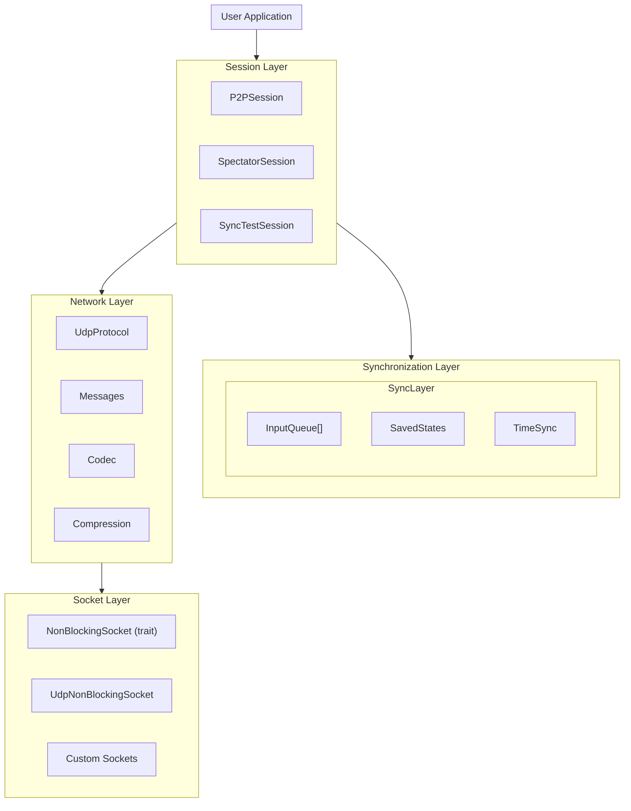
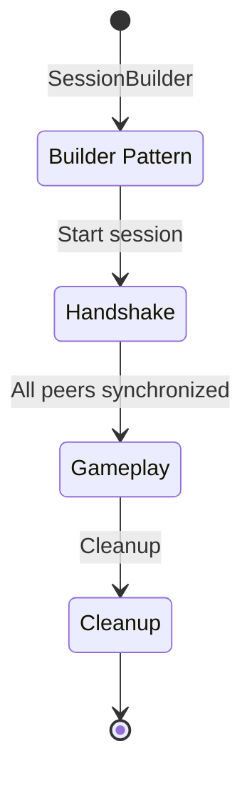
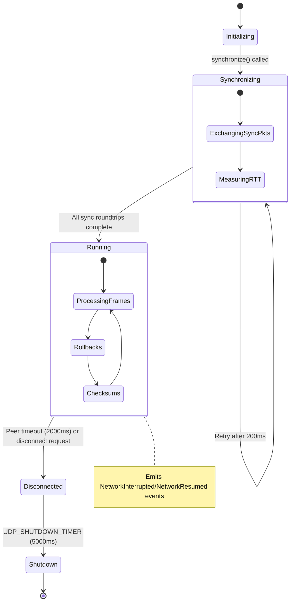
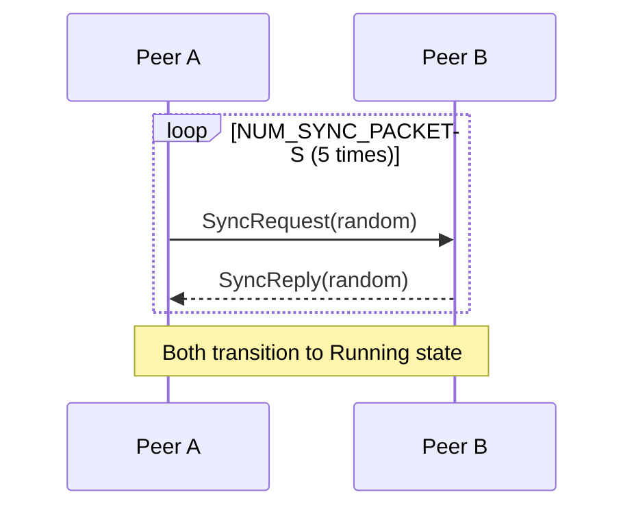
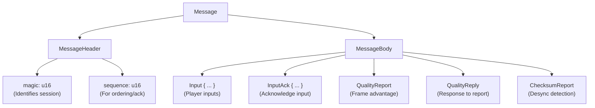

<p align="center">
  
</p>

# Fortress Rollback Architecture Guide

This document provides a comprehensive overview of Fortress Rollback's internal architecture, data flow, and design decisions. Understanding these concepts will help you integrate the library effectively and troubleshoot issues.

## Table of Contents

1. [Overview](#overview)
2. [Core Concepts](#core-concepts)
3. [Component Architecture](#component-architecture)
4. [Data Flow](#data-flow)
5. [Session Types](#session-types)
6. [Session Lifecycle](#session-lifecycle)
7. [Synchronization Protocol](#synchronization-protocol)
8. [Rollback Mechanics](#rollback-mechanics)
9. [State Management](#state-management)
10. [Network Protocol](#network-protocol)
11. [Error Handling](#error-handling)
12. [Type Safety Features](#type-safety-features)

---

## Overview

Fortress Rollback is a Rust implementation of rollback networking for real-time multiplayer games. It's based on the GGPO (Good Game Peace Out) network SDK concepts but with a modern, safe Rust API.

### Design Philosophy

- **100% Safe Rust**: No `unsafe` code blocks; leverages Rust's memory safety guarantees
- **Request-Based API**: Replaces callback-style API with a request-driven control flow
- **Determinism First**: Designed to work with deterministic game simulations
- **Type Safety**: Extensive use of newtypes and the type system to prevent misuse

### High-Level Architecture



---

## Core Concepts

### Frames

A **frame** is the fundamental unit of time in rollback networking. Each frame represents one discrete step of game simulation.

```rust
use fortress_rollback::Frame;

let frame = Frame::new(0);      // First frame
let next = frame + 1;           // Frame arithmetic
assert!(frame.is_valid());      // Check validity
assert!(Frame::NULL.is_null()); // NULL_FRAME represents "no frame"
```

Key properties:

- Frame numbers start at 0 and increment sequentially
- `Frame::NULL` (-1) represents "no frame" or "uninitialized"
- Frames are used to index inputs, saved states, and track synchronization

### Player Handles

A **PlayerHandle** uniquely identifies participants in a session.

```rust
use fortress_rollback::PlayerHandle;

let player = PlayerHandle::new(0);    // First player
let spectator = PlayerHandle::new(2); // Spectator (in 2-player game)

assert!(player.is_valid_player_for(2));    // Valid player handle
assert!(spectator.is_spectator_for(2));    // Spectator handle
```

Handle ranges:

- `0..num_players`: Active players who contribute inputs
- `num_players..`: Spectators who observe but don't contribute

### Player Types

```rust
pub enum PlayerType<A> {
    Local,         // Plays on this device
    Remote(A),     // Plays on a remote device (A = address)
    Spectator(A),  // Observes from a remote device
}
```

### Session States

```rust
pub enum SessionState {
    Synchronizing, // Establishing connection with remotes
    Running,       // Synchronized and accepting input
}
```

---

## Component Architecture

### SyncLayer

The `SyncLayer` is the heart of the synchronization system. It manages:

1. **Input Queues**: One per player, stores received and predicted inputs
2. **Saved States**: Circular buffer of game states for rollback
3. **Frame Tracking**: Current frame, confirmed frame, saved frame

```
SyncLayer
├── input_queues: Vec<InputQueue>  // One per player
├── saved_states: SavedStates      // Circular buffer of GameStateCell
├── current_frame: Frame           // Current simulation frame
├── last_confirmed_frame: Frame    // All inputs received up to here
└── last_saved_frame: Frame        // Most recently saved state
```

**Key Operations:**

- `add_local_input()`: Registers local player input
- `add_remote_input()`: Registers remote player input
- `synchronized_inputs()`: Returns inputs for current frame (confirmed or predicted)
- `save_current_state()`: Creates a save request
- `load_frame()`: Creates a load request for rollback

### InputQueue

Each player has an `InputQueue` that:

- Stores confirmed inputs in a circular buffer (configurable size, default 128 entries via `InputQueueConfig`)
- Generates predictions when inputs haven't arrived
- Tracks the first incorrect prediction for rollback detection
- Uses deterministic prediction based on last confirmed input

```
InputQueue
├── inputs: Vec<PlayerInput<T::Input>>  // Circular buffer (configurable size)
├── head/tail: usize                    // Buffer pointers
├── length: usize                       // Current number of inputs in queue
├── queue_length: usize                 // Maximum buffer capacity (configurable)
├── frame_delay: usize                  // Input delay setting
├── player_index: usize                 // For deterministic prediction
├── last_confirmed_input: Option<Input> // Basis for predictions
├── prediction: PlayerInput<T::Input>   // Pre-allocated prediction slot
├── first_incorrect_frame: Frame        // First wrong prediction
└── last_requested_frame: Frame         // For discard protection
```

**Buffer Size Configuration:**
The buffer size is configurable via `SessionBuilder::with_input_queue_config()`. See `InputQueueConfig` in `/src/sessions/config.rs` for available presets like `InputQueueConfig::high_latency()`.

**Prediction Strategy:**
When an input hasn't arrived, the queue predicts the player will repeat their last confirmed input. This works well for games where players hold buttons (e.g., holding "forward" to move).

### GameStateCell

Game states are stored in `GameStateCell<T>` containers:

```rust
pub struct GameStateCell<T>(Arc<Mutex<GameState<T>>>);

// Usage in save/load requests:
match request {
    FortressRequest::SaveGameState { cell, frame } => {
        cell.save(frame, Some(game_state.clone()), Some(checksum));
    }
    FortressRequest::LoadGameState { cell, frame } => {
        // LoadGameState is only requested for previously saved frames
        if let Some(state) = cell.load() {
            game_state = state;
        }
    }
}
```

The `Arc<Mutex<>>` wrapper allows safe sharing between the library and user code.

### UdpProtocol

The `UdpProtocol` manages communication with a single remote endpoint:

```
UdpProtocol
├── state: ProtocolState              // Initializing/Synchronizing/Running/etc.
├── peer_addr: T::Address             // Remote endpoint address
├── num_players: usize                // Total players in session
├── handles: Arc<[PlayerHandle]>      // Managed player handles
│
├── send_queue: VecDeque<Message>     // Outgoing messages
├── event_queue: VecDeque<Event<T>>   // Events for session
├── pending_output: VecDeque<InputBytes>  // Compressed inputs to send
├── recv_inputs: BTreeMap<Frame, InputBytes>  // Received inputs by frame
├── last_acked_input: InputBytes      // Last acknowledged input
│
├── sync_remaining_roundtrips: u32    // Handshake progress
├── sync_random_requests: BTreeSet    // Sync packet tracking
├── time_sync_layer: TimeSync         // Frame advantage calculation
├── peer_connect_status: Vec<ConnectionStatus>  // Remote's view of all players
│
├── pending_checksums: BTreeMap<Frame, u128>  // For desync detection
└── desync_detection: DesyncDetection // Detection configuration
```

See `/src/network/protocol/mod.rs` for the complete structure.

**Protocol States:**

1. `Initializing`: Not yet started
2. `Synchronizing`: Exchanging sync packets
3. `Running`: Normal operation
4. `Disconnected`: Peer disconnected
5. `Shutdown`: Graceful shutdown in progress

---

## Data Flow

### Input Flow (Local Player)

```
1. User calls add_local_input(handle, input)
   │
2. Input stored in local_inputs map
   │
3. User calls advance_frame()
   │
4. Input sent to SyncLayer.add_local_input()
   │  └─► Stored in InputQueue with frame delay applied
   │
5. Input serialized and queued for all remote endpoints
   │
6. UdpProtocol.send_all_messages() transmits to peers
```

### Input Flow (Remote Player)

```
1. UDP packet received via socket.receive_all_messages()
   │
2. Routed to correct UdpProtocol by address
   │
3. UdpProtocol.handle_message() processes input
   │  └─► Decompressed and stored in recv_inputs
   │
4. Event::Input generated during poll()
   │
5. P2PSession.handle_event() receives Event::Input
   │
6. Input sent to SyncLayer.add_remote_input()
   │  └─► Stored in player's InputQueue
   │  └─► Prediction checked; first_incorrect_frame set if wrong
```

### Rollback Flow

```
1. advance_frame() detects first_incorrect_frame != NULL
   │
2. Determine frame_to_load (first incorrect or last saved)
   │
3. Generate LoadGameState request
   │  └─► User loads the saved state
   │
4. Reset prediction state
   │
5. For each frame from frame_to_load to current_frame:
   │   ├─► Generate SaveGameState request (if not sparse saving)
   │   ├─► Get corrected inputs from InputQueue
   │   └─► Generate AdvanceFrame request
   │
6. Now at original current_frame with corrected state
```

---

## Session Types

### P2PSession

The primary session type for peer-to-peer multiplayer:

```rust
let mut session = SessionBuilder::<MyConfig>::new()
    .with_num_players(2)
    .with_input_delay(2)
    .with_max_prediction_window(8)
    .add_player(PlayerType::Local, PlayerHandle::new(0))?
    .add_player(PlayerType::Remote(addr), PlayerHandle::new(1))?
    .start_p2p_session(socket)?;
```

**Features:**

- Full rollback support
- Automatic synchronization
- Wait recommendations for frame pacing
- Desync detection via checksums
- Spectator support

### SpectatorSession

For observers who don't contribute inputs:

```rust
let session = SessionBuilder::<MyConfig>::new()
    .with_num_players(2)
    .start_spectator_session(host_addr, socket);
```

**Features:**

- Receives confirmed inputs from host
- Catchup mechanism when falling behind
- No rollback needed (always has confirmed inputs)

### SyncTestSession

For testing determinism locally:

```rust
let session = SessionBuilder::<MyConfig>::new()
    .with_num_players(1)
    .with_check_distance(2)
    .start_synctest_session()?;
```

**Features:**

- Simulates rollback every frame
- Compares checksums after resimulation
- Detects non-deterministic behavior

---

## Session Lifecycle

Understanding the full lifecycle of a session is critical for proper integration. A `P2PSession` progresses through distinct phases, and improper handling—especially during termination—can cause determinism failures.

### Lifecycle Phases



### Phase 1: Creation (Builder Pattern)

Sessions are created using `SessionBuilder`:

```rust
let session = SessionBuilder::<MyConfig>::new()
    .with_num_players(2)
    .with_input_delay(2)
    .with_max_prediction_window(8)
    .with_fps(60)?
    .with_desync_detection_mode(DesyncDetection::On { interval: 60 })
    .add_player(PlayerType::Local, PlayerHandle::new(0))?
    .add_player(PlayerType::Remote(peer_addr), PlayerHandle::new(1))?
    .start_p2p_session(socket)?;
```

**State after creation:** `SessionState::Synchronizing`

At this point:

- Network connections are initialized but not yet established
- Input queues are empty
- No game state has been saved

### Phase 2: Synchronizing (Handshake)

During synchronization, peers exchange packets to establish:

- Round-trip time measurements
- Magic number for session identification
- Confirmation both peers are ready

```rust
// Poll until synchronized
loop {
    session.poll_remote_clients();

    // Check synchronization events
    for event in session.events() {
        match event {
            FortressEvent::Synchronizing { addr, count, total, .. } => {
                println!("Syncing with {}: {}/{}", addr, count, total);
            }
            FortressEvent::Synchronized { addr } => {
                println!("Fully synchronized with {}", addr);
            }
            _ => {}
        }
    }

    // Session transitions to Running when all peers synchronized
    if session.current_state() == SessionState::Running {
        break;
    }

    std::thread::sleep(Duration::from_millis(16));
}
```

**Events during synchronization:**

- `Synchronizing { count, total }` — Progress updates
- `Synchronized { addr }` — Peer fully synchronized

**Transition to Running:** Automatic when all remote peers complete handshake

### Phase 3: Running (Gameplay)

This is the main gameplay phase where frames are processed:

```rust
while game_running {
    // 1. Poll network (critical - do this frequently)
    session.poll_remote_clients();

    // 2. Handle events
    for event in session.events() {
        handle_event(event);
    }

    // 3. Only advance frames when Running
    if session.current_state() == SessionState::Running {
        // Add local input
        session.add_local_input(local_handle, input)?;

        // Process frame
        for request in session.advance_frame()? {
            match request {
                FortressRequest::SaveGameState { cell, frame } => {
                    cell.save(frame, Some(state.clone()), Some(checksum));
                }
                FortressRequest::LoadGameState { cell, frame } => {
                    // LoadGameState is only requested for previously saved frames.
                    // Missing state indicates a library bug, but we handle gracefully.
                    if let Some(loaded) = cell.load() {
                        state = loaded;
                    } else {
                        eprintln!("WARNING: LoadGameState for frame {frame:?} but no state found");
                    }
                }
                FortressRequest::AdvanceFrame { inputs } => {
                    state.update(&inputs);
                }
            }
        }
    }
}
```

**Key invariants during Running:**

- `add_local_input()` must be called for all local players before `advance_frame()`
- Requests must be processed in order
- Game state must be deterministic

### Phase 4: Termination (Critical!)

**⚠️ WARNING: Improper termination is the #1 cause of multiplayer bugs.**

#### The Anti-Pattern (DON'T DO THIS)

```rust
// ❌ WRONG: This causes race conditions and flaky behavior
while session.confirmed_frame() < target_frame {
    session.poll_remote_clients();
    if session.current_state() == SessionState::Running {
        session.add_local_input(handle, input)?;
        session.advance_frame()?;
    }
}
// Session dropped here - but sync status unknown!
```

The problem: `confirmed_frame()` reaching your target does NOT mean:

- Both peers have the same game state
- All rollbacks have completed
- Checksums have been verified

#### The Correct Pattern

```rust
// ✅ CORRECT: Use sync_health() to verify synchronization
use fortress_rollback::SyncHealth;

// Continue until sync verified
loop {
    session.poll_remote_clients();

    // Check if synchronized
    let all_synced = session.local_player_handles()
        .iter()
        .filter_map(|h| session.sync_health(*h))
        .all(|health| matches!(health, SyncHealth::InSync));

    if all_synced && session.confirmed_frame() >= target_frame {
        // Safe to terminate - checksums match
        break;
    }

    // Check for desync
    for handle in session.local_player_handles() {
        if let Some(SyncHealth::DesyncDetected { frame, .. }) = session.sync_health(handle) {
            panic!("Desync detected at frame {}!", frame);
        }
    }

    // Continue processing
    if session.current_state() == SessionState::Running {
        session.add_local_input(handle, input)?;
        for request in session.advance_frame()? {
            handle_request(request, &mut state);
        }
    }

    std::thread::sleep(Duration::from_millis(1));
}
```

#### Termination Checklist

Before dropping a session, verify:

1. ✅ `sync_health()` returns `InSync` for all remote peers
2. ✅ `confirmed_frame()` has reached your target
3. ✅ No pending `DesyncDetected` events
4. ✅ Final game state has been synchronized

### SessionState vs ProtocolState

**Important:** There are two distinct state types in Fortress Rollback:

- **`SessionState`** (2 states): The high-level session state visible to users
  - `Synchronizing` — Establishing connection with remotes
  - `Running` — Synchronized and accepting input

- **`ProtocolState`** (5 states): Internal per-peer protocol state
  - `Initializing` → `Synchronizing` → `Running` → `Disconnected` → `Shutdown`

The session exposes `SessionState` via `session.current_state()`. The protocol states are internal implementation details.

### Protocol State Machine

The diagram below shows `ProtocolState` transitions for each remote peer connection. Note that `NetworkInterrupted` and `NetworkResumed` are **events** emitted during the `Running` state, not separate states.



### FortressRequest Semantics

Each request type has specific implications for game state:

| Request | When Generated | Game State Impact |
|---------|----------------|-------------------|
| `SaveGameState` | Before advancing a frame | Clone current state to cell |
| `LoadGameState` | Rollback triggered | Replace state with saved version |
| `AdvanceFrame` | Each simulation step | Apply inputs, increment frame |

**Request Ordering Guarantees:**

1. `LoadGameState` always precedes re-simulation `AdvanceFrame` requests
2. `SaveGameState` comes before its corresponding `AdvanceFrame`
3. A rollback sequence looks like: `Load → (Save → Advance)* → Save → Advance`

**Example Rollback Sequence:**

```
Current frame: 10, rollback to frame 7

Requests generated:
1. LoadGameState { frame: 7 }     // Restore state at frame 7
2. SaveGameState { frame: 7 }     // Re-save (sparse mode skips this)
3. AdvanceFrame { inputs: [...] } // Resimulate frame 7→8
4. SaveGameState { frame: 8 }
5. AdvanceFrame { inputs: [...] } // Resimulate frame 8→9
6. SaveGameState { frame: 9 }
7. AdvanceFrame { inputs: [...] } // Resimulate frame 9→10
8. SaveGameState { frame: 10 }
9. AdvanceFrame { inputs: [...] } // New frame 10→11
```

---

## Synchronization Protocol

### Initial Sync

Before gameplay begins, peers exchange sync packets:



This establishes:

- Round-trip time measurement
- Magic number exchange for packet validation
- Confirmation that both peers are ready

### During Gameplay

Regular message exchange:



### Time Synchronization

The `TimeSync` component tracks frame advantage:

```
local_frame_advantage = estimated_remote_frame - local_frame
```

If you're ahead of your opponent (positive advantage), you receive `WaitRecommendation` events suggesting you slow down.

---

## Rollback Mechanics

### When Rollback Occurs

Rollback is triggered when:

1. A prediction is proven wrong (received input differs from prediction)
2. A remote player disconnects (need to resimulate with disconnect flag)

### Rollback Process

```rust
// Simplified rollback flow in adjust_gamestate()

let frame_to_load = if sparse_saving {
    last_saved_frame
} else {
    first_incorrect_frame
};

// 1. Load the old state
requests.push(sync_layer.load_frame(frame_to_load)?);
sync_layer.reset_prediction();

// 2. Resimulate each frame
for _ in 0..frames_to_resimulate {
    let inputs = sync_layer.synchronized_inputs(&connect_status);

    if !sparse_saving {
        requests.push(sync_layer.save_current_state());
    }

    sync_layer.advance_frame();
    requests.push(FortressRequest::AdvanceFrame { inputs });
}
```

### Sparse vs. Full Saving

**Full Saving (default):**

- Saves state every frame
- Minimal resimulation on rollback
- Higher memory/CPU for saves

**Sparse Saving:**

- Only saves at confirmed frames
- Longer rollbacks but fewer saves
- Better when save is expensive

---

## State Management

### Prediction Window

The `max_prediction` setting limits how far ahead simulation can run without confirmed inputs:

```
Confirmed    Current
Frame        Frame
  ↓            ↓
  5            13

  Prediction Window = 8 frames

  Frames 6-12 may need rollback if predictions were wrong
```

### Saved States Buffer

States are stored in a circular buffer of size `max_prediction + 1`:

```
max_prediction = 8
buffer size = 9

Frame:  [0] [1] [2] [3] [4] [5] [6] [7] [8]
               ↑                       ↑
           confirmed              current

After advancing past frame 8:
Frame:  [9] [1] [2] [3] [4] [5] [6] [7] [8]
         ↑                             ↑
      current                      oldest
```

### Connection Status

Each player has a `ConnectionStatus`:

```rust
pub struct ConnectionStatus {
    pub disconnected: bool,  // Is the player disconnected?
    pub last_frame: Frame,   // Last frame we received input for
}
```

This is used to:

- Determine the confirmed frame (minimum of all `last_frame` values)
- Skip disconnected players during input collection
- Handle disconnect rollbacks

---

## Network Protocol

### Binary Codec (`network::codec`)

The codec module provides centralized, deterministic serialization for all network messages using bincode. It encapsulates configuration to ensure consistent encoding across the codebase.

**Key Design Points:**

- **Centralized Configuration**: Single bincode config with fixed-size integers for deterministic message sizes
- **Zero-Allocation Options**: `encode_into` writes to existing buffers for hot paths
- **Clear Error Handling**: `CodecResult<T>` with descriptive error variants

```rust
use fortress_rollback::network::codec::{encode, decode, encode_into, CodecError};

// Encode any serializable type (allocates)
let data: u32 = 42;
let bytes = encode(&data)?;

// Decode from bytes
let (decoded, bytes_read): (u32, _) = decode(&bytes)?;
debug_assert_eq!(data, decoded);

// Zero-allocation encoding into pre-allocated buffer
let mut buffer = [0u8; 256];
let len = encode_into(&data, &mut buffer)?;
```

**Available Functions:**

| Function | Description | Use Case |
|----------|-------------|----------|
| `encode()` | Encode to new `Vec<u8>` | Simple/infrequent encoding |
| `encode_into()` | Encode to existing slice | Hot paths, buffer reuse |
| `encode_append()` | Append to existing `Vec` | Incremental message building |
| `decode()` | Decode with bytes consumed | When you need byte count |
| `decode_value()` | Decode ignoring byte count | Convenience when count not needed |

**Why Fixed-Size Integers:**

- Ensures deterministic message sizes (critical for rollback)
- Standard config compatible across platforms
- No variable-length encoding overhead

### Input Compression (`network::compression`)

Inputs are compressed using a two-stage pipeline to minimize bandwidth:

```
Input Bytes → XOR Delta Encoding → RLE Compression → Network
```

**Stage 1: XOR Delta Encoding**

Each input is XOR'd against a reference (typically the first input):

```
Reference:  [0x01, 0x02, 0x03, 0x04]
Input:      [0x01, 0x02, 0x05, 0x04]
XOR Result: [0x00, 0x00, 0x06, 0x00]  // Many zeros = compressible!
```

Since consecutive game inputs are often similar (player holds same button), XOR produces many zero bytes.

**Stage 2: RLE Compression**

Run-Length Encoding compresses sequences of identical bytes:

```
[0x00, 0x00, 0x00, 0x00, 0x06, 0x00] → [RLE: 4×0x00, 1×0x06, 1×0x00]
```

**Compression Pipeline:**

```rust
// Internal usage (not public API)
use fortress_rollback::__internal::{encode, decode, delta_encode, delta_decode};

// Encode: XOR delta + RLE
let reference = vec![0, 0, 0, 1];
let inputs = vec![vec![0, 0, 1, 1], vec![0, 1, 0, 1]];
let compressed = encode(&reference, inputs.iter());

// Decode: RLE decompress + XOR reverse
let decompressed = decode(&reference, &compressed)?;
debug_assert_eq!(inputs, decompressed);
```

**Properties:**

- Encoding is deterministic (same inputs → same output)
- XOR is self-inverse: `(a ⊕ b) ⊕ b = a`
- Works best when inputs change slowly (typical for games)

### Reliability

The protocol is UDP-based (unreliable) but handles:

- **Lost packets**: Inputs are resent until acknowledged
- **Out-of-order**: Sequence numbers for ordering
- **Duplicates**: Ignored via sequence tracking

### Keep-Alive

Regular packets maintain connection:

- `KEEP_ALIVE_INTERVAL`: 200ms
- `QualityReport` sent every 200ms
- Disconnect after `disconnect_timeout` (default 2s)

---

## Error Handling

### FortressError

All errors use a single enum (see [User Guide - Error Handling](User-Guide#error-handling) for complete documentation):

```rust
pub enum FortressError {
    PredictionThreshold,
    NotSynchronized,
    InvalidRequest { info: String },
    InvalidPlayerHandle { handle: PlayerHandle, max_handle: PlayerHandle },
    InvalidFrame { frame: Frame, reason: String },
    MissingInput { player_handle: PlayerHandle, frame: Frame },
    MismatchedChecksum { current_frame: Frame, mismatched_frames: Vec<Frame> },
    SpectatorTooFarBehind,
    SerializationError { context: String },
    SocketError { context: String },
    InternalError { context: String },
    // ... (see error.rs for all variants)
}
```

### Violation Observer

The telemetry system monitors internal specification violations—issues that don't necessarily cause errors but indicate unexpected behavior. See [User Guide - Specification Violations](User-Guide#specification-violations-telemetry) for complete documentation.

```rust
use fortress_rollback::telemetry::{CollectingObserver, ViolationKind};
use std::sync::Arc;

let observer = Arc::new(CollectingObserver::new());
let session = SessionBuilder::<MyConfig>::new()
    .with_violation_observer(observer.clone())
    .start_p2p_session(socket)?;

// After operations, check for violations
for violation in observer.violations() {
    eprintln!(
        "[{}/{}] {} at {}",
        violation.severity,
        violation.kind,
        violation.message,
        violation.location
    );
}

// Check for specific violation types
if observer.has_violation(ViolationKind::FrameSync) {
    eprintln!("Frame synchronization issues detected");
}
```

**Violation Severities:**

- `Warning`: Unexpected but recoverable
- `Error`: Serious issue with degraded behavior
- `Critical`: Invariant broken, state may be corrupt

**Violation Kinds:**

- `FrameSync`: Frame counter issues
- `InputQueue`: Input sequence anomalies
- `StateManagement`: Save/load issues
- `NetworkProtocol`: Protocol state errors
- `ChecksumMismatch`: Desync detection
- `Synchronization`: Connection issues
- `Configuration`: Invalid settings
- `InternalError`: Library bugs
- `Invariant`: Runtime check failures

---

## Type Safety Features

### Frame Newtype

Prevents mixing frame numbers with arbitrary integers:

```rust
let frame = Frame::new(5);
let next = frame + 1;        // OK: Frame + i32 -> Frame
let diff = next - frame;     // OK: Frame - Frame -> i32
// let bad = 5 + frame;      // Compile error: no i32 + Frame
```

### PlayerHandle Newtype

Prevents invalid handle usage:

```rust
let handle = PlayerHandle::new(0);
if handle.is_valid_player_for(num_players) {
    // Safe to use as player index
}
```

### Config Trait

Compile-time parameterization bundles all type requirements:

```rust
pub trait Config: 'static {
    type Input: Copy + Clone + PartialEq + Default + Serialize + DeserializeOwned;
    type State;
    type Address: Clone + PartialEq + Eq + PartialOrd + Ord + Hash + Debug;
}
```

This ensures:

- Input types are serializable for network transmission
- State types are clonable (required in practice for `GameStateCell::load()` during rollback; compile-time `Clone` bound only with `sync-send` feature)
- Addresses can be used as map keys

---

## Summary

Fortress Rollback provides a robust foundation for rollback networking:

1. **Sessions** manage the high-level game flow
2. **SyncLayer** coordinates input collection and state management
3. **InputQueue** handles per-player input storage and prediction
4. **UdpProtocol** manages peer communication
5. **Type-safe primitives** (Frame, PlayerHandle) prevent common errors

The request-based API gives you full control over when saves, loads, and advances happen, making integration with your game loop straightforward.

For practical usage examples, see the [User Guide](User-Guide).
