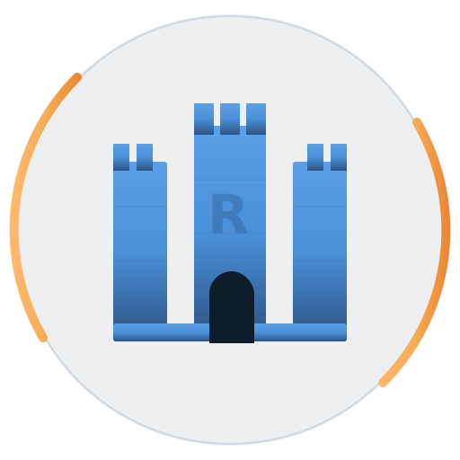
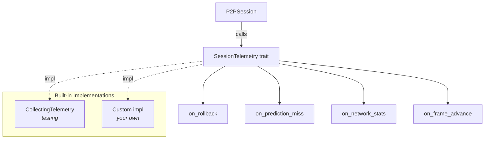
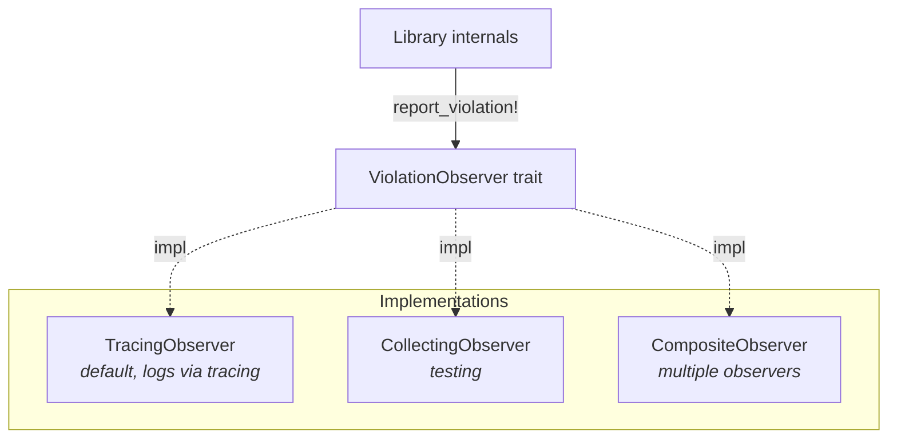
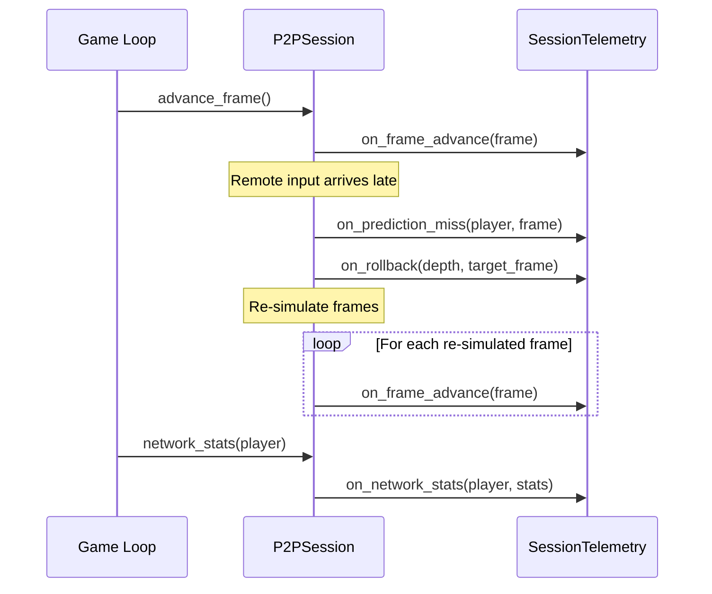

<!-- SYNC: This wiki page is generated from docs/telemetry.md. Edit docs source. -->

<p align="center">
  
</p>

# Session Telemetry

Monitor P2P session performance with structured telemetry events. Track rollbacks, prediction misses, frame advances, and network stats in real time.

## Table of Contents

1. [Architecture](#architecture)
2. [Quick Start](#quick-start)
3. [`SessionTelemetry` Trait](#sessiontelemetry-trait)
4. [`TelemetryEvent` Enum](#telemetryevent-enum)
5. [`CollectingTelemetry` (Built-in)](#collectingtelemetry-built-in)
6. [Custom Telemetry Observer](#custom-telemetry-observer)
7. [Spec Violation Observability](#spec-violation-observability)
   - [`ViolationObserver` Trait](#violationobserver-trait)
   - [`SpecViolation` Struct](#specviolation-struct)
   - [`CollectingObserver`](#collectingobserver)
   - [`TracingObserver`](#tracingobserver)
   - [`ViolationKind` Variants](#violationkind-variants)
   - [`ViolationSeverity` Levels](#violationseverity-levels)
8. [Event Flow](#event-flow)
9. [Use Cases](#use-cases)
10. [Integration Tips](#integration-tips)
11. [See Also](#see-also)

---

## Architecture



---

## Quick Start

```rust
use fortress_rollback::telemetry::{CollectingTelemetry, SessionTelemetry};
use fortress_rollback::SessionBuilder;
use std::sync::Arc;

// 1. Create a telemetry observer
let telemetry = Arc::new(CollectingTelemetry::new());

// 2. Pass to session builder
// MyConfig: your Config impl (see user-guide.md)
let builder = SessionBuilder::<MyConfig>::new()
    .with_telemetry(telemetry.clone());

// 3. After running the session, inspect events
let rollbacks = telemetry.rollbacks();
let misses = telemetry.prediction_misses();
println!("Rollbacks: {}, Prediction misses: {}", rollbacks.len(), misses.len());
```

---

## `SessionTelemetry` Trait

```rust
// With `sync-send` feature enabled:
pub trait SessionTelemetry: Send + Sync {
    fn on_rollback(&self, depth: usize, frame: Frame) { /* no-op */ }
    fn on_prediction_miss(&self, player: PlayerHandle, frame: Frame) { /* no-op */ }
    fn on_network_stats(&self, player: PlayerHandle, stats: &NetworkStats) { /* no-op */ }
    fn on_frame_advance(&self, frame: Frame) { /* no-op */ }
}

// Without `sync-send` feature:
pub trait SessionTelemetry {
    // same methods, no Send + Sync bounds
}
```

> **Note**
>
> All methods have default no-op implementations. Override only what you need. The `Send + Sync` supertraits are only required when the `sync-send` feature is enabled.
>
| Method | Parameters | When Called |
|--------|-----------|-------------|
| `on_rollback` | `depth: usize`, `frame: Frame` | State was rolled back |
| `on_prediction_miss` | `player: PlayerHandle`, `frame: Frame` | Predicted input was wrong |
| `on_network_stats` | `player: PlayerHandle`, `stats: &NetworkStats` | Network stats polled |
| `on_frame_advance` | `frame: Frame` | Frame advanced |

---

## `TelemetryEvent` Enum

Each variant captures the arguments from its corresponding trait method.

| Variant | Fields | When |
|---------|--------|------|
| `Rollback` | `depth: usize`, `frame: Frame` | State was rolled back |
| `PredictionMiss` | `player: PlayerHandle`, `frame: Frame` | Predicted input was wrong |
| `NetworkStatsUpdate` | `player: PlayerHandle`, `stats: NetworkStats` | Network stats polled |
| `FrameAdvance` | `frame: Frame` | Frame advanced |

---

## `CollectingTelemetry` (Built-in)

Thread-safe observer that accumulates all events for later inspection.

| Method | Returns |
|--------|---------|
| `new()` | Empty collector |
| `events()` | `Vec<TelemetryEvent>` -- all events |
| `rollbacks()` | `Vec<TelemetryEvent>` -- filtered rollback events |
| `prediction_misses()` | `Vec<TelemetryEvent>` -- filtered prediction misses |
| `network_stats_updates()` | `Vec<TelemetryEvent>` -- filtered network stats |
| `frame_advances()` | `Vec<TelemetryEvent>` -- filtered frame advances |
| `len()` | `usize` -- event count |
| `is_empty()` | `bool` -- no events collected? |
| `clear()` | Clear all collected events |

---

## Custom Telemetry Observer

Implement `SessionTelemetry` for your own metrics system:

```rust
use fortress_rollback::telemetry::SessionTelemetry;
use fortress_rollback::{Frame, PlayerHandle};
use fortress_rollback::NetworkStats;
use std::sync::atomic::{AtomicUsize, Ordering};

struct MetricsTelemetry {
    rollback_count: AtomicUsize,
    prediction_miss_count: AtomicUsize,
}

impl SessionTelemetry for MetricsTelemetry {
    fn on_rollback(&self, depth: usize, _frame: Frame) {
        self.rollback_count.fetch_add(1, Ordering::Relaxed);
        tracing::info!(depth, "rollback occurred");
    }

    fn on_prediction_miss(&self, player: PlayerHandle, frame: Frame) {
        self.prediction_miss_count.fetch_add(1, Ordering::Relaxed);
        tracing::debug!(%player, %frame, "prediction miss");
    }
}
```

---

## Spec Violation Observability

The telemetry module also provides a structured pipeline for specification violations -- internal invariant failures detected at runtime.



### `ViolationObserver` Trait

```rust
// With `sync-send` feature enabled:
pub trait ViolationObserver: Send + Sync {
    fn on_violation(&self, violation: &SpecViolation);
}

// Without `sync-send` feature:
pub trait ViolationObserver {
    // same method, no Send + Sync bounds
}
```

### `SpecViolation` Struct

Each violation carries structured context:

| Field | Type |
|-------|------|
| `severity` | `ViolationSeverity` |
| `kind` | `ViolationKind` |
| `message` | `String` |
| `location` | `&'static str` |
| `frame` | `Option<Frame>` |
| `context` | `BTreeMap<String, String>` |

**Builder methods:**

| Method | Description |
|--------|-------------|
| `new(severity, kind, message, location)` | Create a new violation |
| `with_frame(frame)` | Attach a frame reference |
| `with_context(key, value)` | Add a key-value context entry |
| `to_json()` | `Option<String>` -- JSON string (requires `json` feature) |
| `to_json_pretty()` | `Option<String>` -- pretty JSON string (requires `json` feature) |

### `CollectingObserver`

Thread-safe observer that accumulates all violations for later inspection.

| Method | Returns |
|--------|---------|
| `new()` | Empty collector |
| `violations()` | `Vec<SpecViolation>` — all collected violations |
| `len()` | Number of violations |
| `is_empty()` | No violations collected? |
| `has_violation(kind)` | Any violation of this kind? |
| `has_severity(severity)` | Any violation at this severity? |
| `violations_of_kind(kind)` | Filtered by kind |
| `violations_at_severity(min)` | Filtered by minimum severity |
| `clear()` | Remove all collected violations |

### `TracingObserver`

Default observer that maps severity levels to tracing log levels: `Warning` → `tracing::warn!`, `Error`/`Critical` → `tracing::error!`. All fields are emitted as structured tracing fields.

### Plugging In

```rust
use fortress_rollback::telemetry::CollectingObserver;
use fortress_rollback::SessionBuilder;
use std::sync::Arc;

let observer = Arc::new(CollectingObserver::new());
// MyConfig: your Config impl (see user-guide.md)
let builder = SessionBuilder::<MyConfig>::new()
    .with_violation_observer(observer.clone());

// After session operations
assert!(observer.violations().is_empty(), "unexpected violations");
```

### `ViolationKind` Variants

| Variant | Description |
|---------|-------------|
| `FrameSync` | Frame synchronization invariant violated |
| `InputQueue` | Input queue invariant violated |
| `StateManagement` | State save/load invariant violated |
| `NetworkProtocol` | Network protocol invariant violated |
| `ChecksumMismatch` | Checksum or desync detection issue |
| `Configuration` | Configuration constraint violated |
| `InternalError` | Internal logic error (library bug) |
| `Invariant` | Runtime invariant check failed |
| `Synchronization` | Sync protocol issues |
| `ArithmeticOverflow` | Arithmetic overflow detected |

### `ViolationSeverity` Levels

| Level | Meaning |
|-------|---------|
| `Warning` | Unexpected but recoverable -- operation continued with fallback |
| `Error` | Serious issue -- operation may have degraded behavior |
| `Critical` | Critical invariant broken -- state may be corrupted |

---

## Event Flow



---

## Use Cases

- **Performance monitoring** -- Track rollback frequency and prediction accuracy over time
- **Network quality dashboards** -- Aggregate `NetworkStatsUpdate` events per peer
- **Automated testing assertions** -- Use `CollectingTelemetry` to assert rollback counts, prediction accuracy
- **Debug overlays** -- Display rollback count, ping, and frame advantage in a HUD

---

## Integration Tips

> **Performance**
>
> Keep observer callbacks fast -- they run inline during frame processing. Offload heavy work (file I/O, network sends) to a background thread.
>
> **Tip**
>
> Use `Arc<CollectingTelemetry>` for testing, a custom `SessionTelemetry` impl for production.
>
> **Safety**
>
> Both `SessionTelemetry` and `ViolationObserver` require `Send + Sync` when the `sync-send` feature is enabled. The `sync-send` feature is not a default feature and must be explicitly opted into. All built-in implementations are thread-safe regardless of feature flags.
>
---

## See Also

- [User Guide](User-Guide) — integrating Fortress Rollback into your game
- [Architecture Overview](Architecture) — system design and module structure
